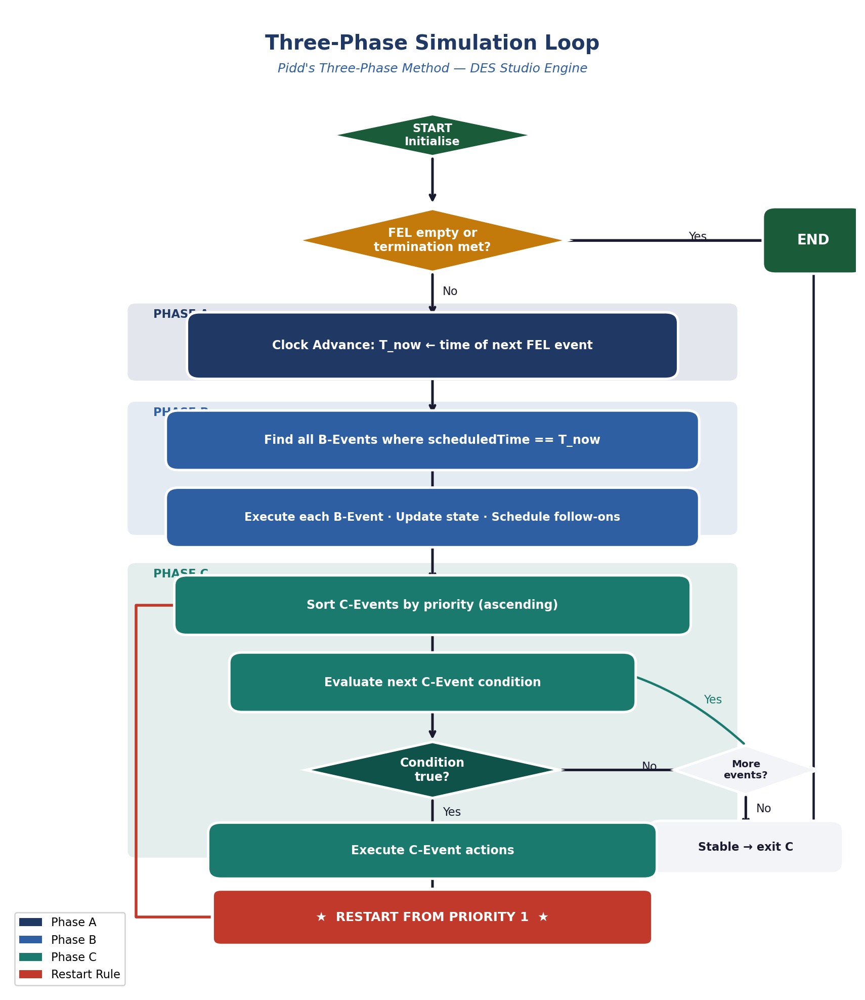
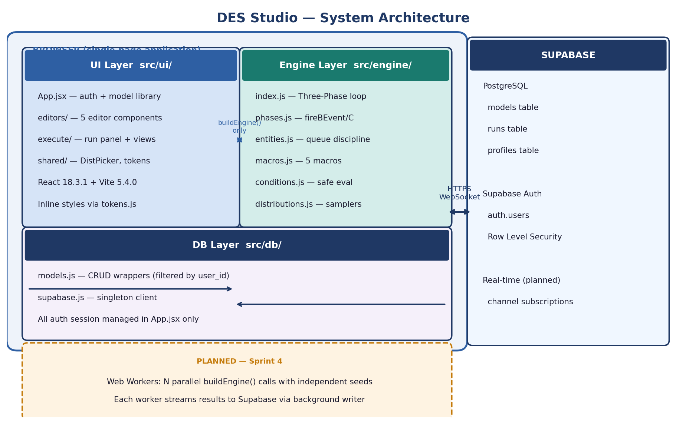
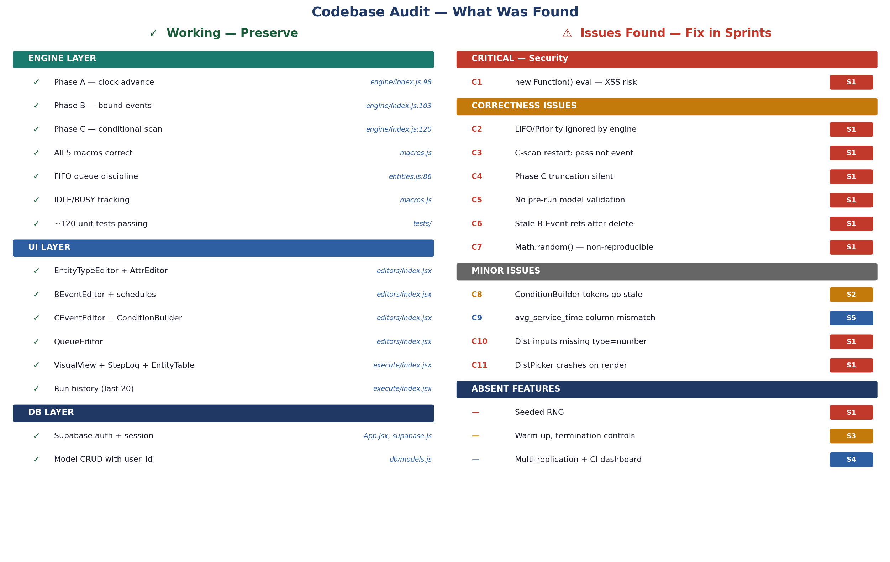
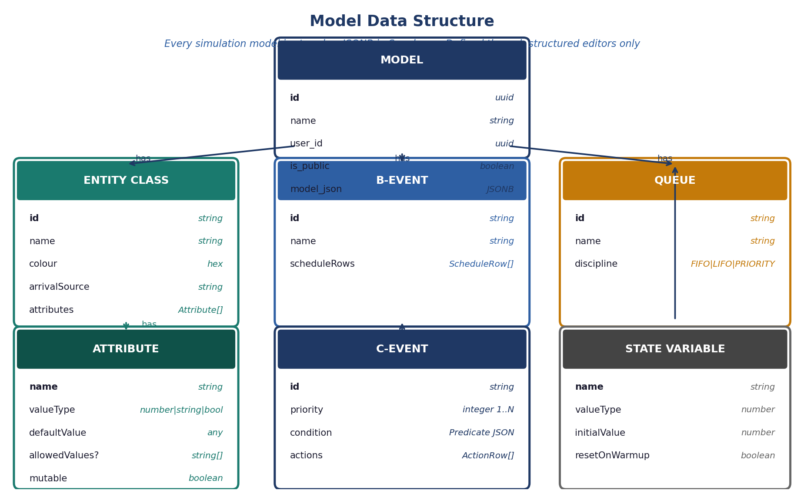
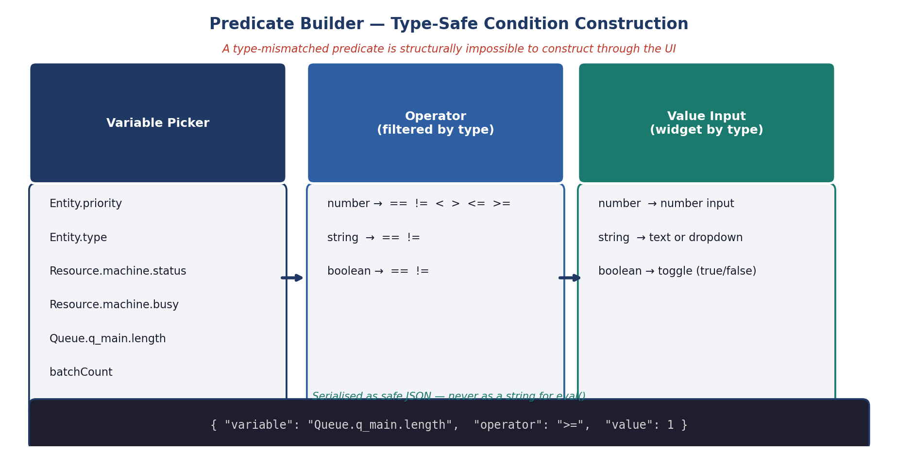
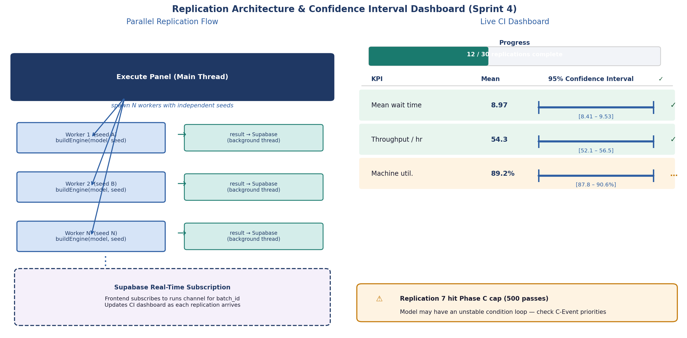
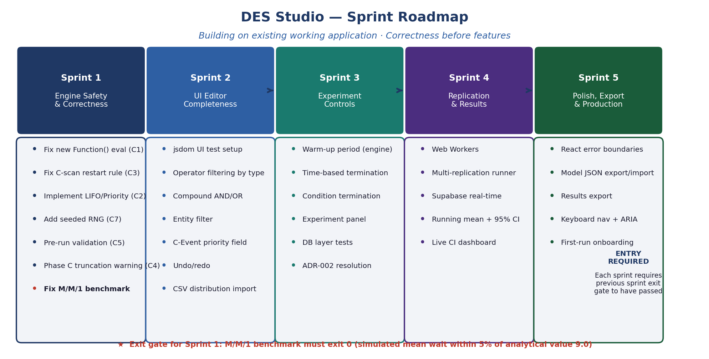

# DES Studio — Solution Description
*A Professional Discrete Event Simulation Modelling Tool*
*Document version 1.0 | Based on: Specification v1, Full Codebase Audit 2026-04-30, Sprint Plan v2.0*

---

## Contents

1. [What DES Studio Is](#1-what-des-studio-is)
2. [The Three-Phase Method](#2-the-three-phase-method)
3. [System Architecture](#3-system-architecture)
4. [What Was Built and What Was Found](#4-what-was-built-and-what-was-found)
5. [The Entity and Model Data Model](#5-the-entity-and-model-data-model)
6. [The Model Editor UI](#6-the-model-editor-ui)
7. [The Execution Engine](#7-the-execution-engine)
8. [The Predicate Builder](#8-the-predicate-builder)
9. [Probability Distributions](#9-probability-distributions)
10. [Experiment Controls](#10-experiment-controls)
11. [Replication and Statistical Results](#11-replication-and-statistical-results)
12. [Multi-User Architecture](#12-multi-user-architecture)
13. [The Build Strategy](#13-the-build-strategy)
14. [Sprint Roadmap](#14-sprint-roadmap)

---

## 1. What DES Studio Is

DES Studio is a browser-based discrete event simulation (DES) modelling tool. It enables simulation practitioners to build, validate, and run stochastic models of real-world systems — manufacturing lines, healthcare pathways, logistics networks, service operations — without writing code.

A modeller defines how entities (customers, jobs, patients) move through a system: where they arrive, where they wait, what activities consume them, what resources they use, and what conditions control the flow. The tool executes the model using the **Three-Phase Method** developed by Professor Pidd, a rigorous simulation execution protocol used in professional practice.

### Core capabilities

- **Structured model definition** via form-based editors for all five model element types — no free-text logic entry
- **Three-Phase execution engine** with correct A/B/C phasing and iterative C-Scan
- **Multi-user access** with Supabase authentication — models are private by default and shareable
- **Run history and result visualisation** including visual execution view, step log, and entity status
- **Parallel replication** (planned) with live confidence interval streaming

DES Studio is built to be extended. The distribution system is open and pluggable. The macro vocabulary is formally specified. Architectural decisions are recorded in ADRs so every non-obvious choice has a documented rationale.

---

## 2. The Three-Phase Method

The Three-Phase Method is the execution protocol at the heart of DES Studio. It was chosen specifically because it correctly handles the interaction between deterministic scheduled events (B-Events) and conditional state-dependent events (C-Events) — something that SimPy's standard process/resource model does not enforce structurally.

### The simulation clock and the Future Events List

At any point in a simulation, the engine maintains a **Future Events List (FEL)** — a sorted list of B-Events scheduled to fire at specific future times. The simulation clock `T_now` only ever advances to the time of the next FEL entry.

### The three phases


*Figure 1: The Three-Phase simulation loop showing Phase A clock advance, Phase B bound event execution, Phase C iterative conditional scan, and the restart rule.*

```
┌─────────────────────────────────────────────────────────────────────┐
│                        SIMULATION LOOP                              │
│                                                                     │
│  ┌──────────────────────────────────────────────────────────────┐   │
│  │  PHASE A — Clock Advance                                     │   │
│  │                                                              │   │
│  │  T_now ← scheduledTime of next event on FEL                 │   │
│  └──────────────────────────────────────┬───────────────────────┘   │
│                                         │                           │
│  ┌──────────────────────────────────────▼───────────────────────┐   │
│  │  PHASE B — Bound Events                                      │   │
│  │                                                              │   │
│  │  For every B-Event on FEL where scheduledTime == T_now:      │   │
│  │    execute B-Event (machine completes, entity arrives, etc.) │   │
│  │    update system state                                       │   │
│  └──────────────────────────────────────┬───────────────────────┘   │
│                                         │                           │
│  ┌──────────────────────────────────────▼───────────────────────┐   │
│  │  PHASE C — Conditional Scan (Iterative C-Scan)               │   │
│  │                                                              │   │
│  │  REPEAT until full scan finds no fireable C-Events:          │   │
│  │    for each C-Event ordered by priority (ascending):         │   │
│  │      if condition is TRUE:                                   │   │
│  │        execute C-Event actions (seize resource, etc.)        │   │
│  │        ★ RESTART scan from Priority 1 immediately ★          │   │
│  │                                                              │   │
│  └──────────────────────────────────────┬───────────────────────┘   │
│                                         │                           │
│              Repeat until FEL empty or termination condition met    │
└─────────────────────────────────────────────────────────────────────┘
```

### The restart rule — why it matters

When a C-Event fires during Phase C, it changes the simulation state. A higher-priority C-Event that was previously not fireable may now be fireable as a result. The restart rule ensures that after any C-Event fires, the scan returns to Priority 1 so that no higher-priority conditional event is bypassed.

Without the restart rule — firing Phase C events in sequence without restarting — priority inversion can occur in models with more than two C-Events. The audit found this bug in the existing codebase and it is the first correctness fix in Sprint 1.

### B-Events vs C-Events

| | B-Event (Bound) | C-Event (Conditional) |
|---|---|---|
| **Trigger** | Scheduled time on FEL | Condition evaluated to true |
| **Nature** | Deterministic — will fire | Conditional — may or may not fire |
| **Examples** | Entity arrival, service completion, patience timeout | Seize resource, assign attribute, update counter |
| **Phase** | Phase B | Phase C |
| **Scheduling** | `T_fire = T_now + sample(distribution)` | No scheduling — fires when state allows |

---

## 3. System Architecture

### Current architecture (as audited)

DES Studio is a **browser-only single-page application**. The simulation engine runs on the browser's main thread. There is no backend server.

```
┌─────────────────────────────────────────────────────────────────────┐
│                         BROWSER                                     │
│                                                                     │
│  ┌─────────────────────────────────────────────────────────────┐   │
│  │  React 18.3.1 + Vite 5.4.0 (JSX, ESM, inline styles)      │   │
│  │                                                             │   │
│  │  ┌─────────────────┐   ┌─────────────────┐                │   │
│  │  │  src/ui/        │   │  src/engine/    │                │   │
│  │  │  editors/       │   │  index.js       │                │   │
│  │  │  execute/       │◄──│  phases.js      │                │   │
│  │  │  shared/        │   │  entities.js    │                │   │
│  │  │  App.jsx        │   │  macros.js      │                │   │
│  │  └────────┬────────┘   │  conditions.js  │                │   │
│  │           │            │  distributions.js│               │   │
│  │           │            └─────────────────┘                │   │
│  │           │                                               │   │
│  │  ┌────────▼────────┐                                      │   │
│  │  │  src/db/        │                                      │   │
│  │  │  models.js      │                                      │   │
│  │  │  supabase.js    │                                      │   │
│  │  └────────┬────────┘                                      │   │
│  └───────────┼─────────────────────────────────────────────── ┘   │
│              │                                                      │
└──────────────┼──────────────────────────────────────────────────── ┘
               │ HTTPS / WebSocket
┌──────────────▼──────────────────────────────────────────────────── ┐
│                       SUPABASE                                      │
│                                                                     │
│   PostgreSQL                Auth              Real-time             │
│   ┌─────────┐          ┌──────────┐       ┌──────────────┐         │
│   │ models  │          │auth.users│       │  (planned)   │         │
│   │ runs    │          │ profiles │       │  channel sub │         │
│   └─────────┘          └──────────┘       └──────────────┘         │
└─────────────────────────────────────────────────────────────────────┘
```

### Separation of concerns

The three source directories enforce a strict separation that must be preserved throughout development:

```
src/
├── engine/    Pure JavaScript — no React, no DOM, no Supabase
│              Tested with Vitest in node environment
│              buildEngine() is the only public interface
│
├── ui/        React components — no direct Supabase queries
│              All engine access through buildEngine() only
│              All DB access through src/db/ only
│
└── db/        Supabase CRUD wrappers — no simulation logic
               All queries filtered by user_id for data isolation
```


*Figure 2: Current system architecture — browser-only SPA with Supabase persistence.*

### Planned architecture (target state)

The specification described a more capable backend. This reflects the target direction for later sprints:

```
┌──────────────────────────────────────────────────────────────────┐
│                         BROWSER                                  │
│                                                                  │
│   React UI                         Web Workers                  │
│   ┌────────────────────┐           ┌─────────────────────┐      │
│   │ Model editor       │           │ Worker 1 (seed: A)  │      │
│   │ Predicate Builder  │  spawn    │ buildEngine()       │      │
│   │ Experiment panel   │──────────►│                     │      │
│   │ Live CI dashboard  │           │ Worker 2 (seed: B)  │      │
│   │                    │◄──────────│ buildEngine()       │      │
│   └────────────────────┘  results  │                     │      │
│                                    │ Worker N (seed: N)  │      │
│                                    └─────────────────────┘      │
└──────────────────────────────────────────────────────────────────┘
                              │
                    Supabase real-time
                    (result streaming)
                              │
┌──────────────────────────────────────────────────────────────────┐
│                         SUPABASE                                 │
│   models · runs · profiles · replications · results             │
└──────────────────────────────────────────────────────────────────┘
```

---

## 4. What Was Built and What Was Found

A full codebase audit was completed on 2026-04-30 covering all 15 source files. The audit compared the specification's intent against the actual implementation.


*Figure 3: Codebase audit summary — what works correctly (left) and issues found (right) with sprint assignments.*

### The headline finding

> *"The Three-Phase engine is the core intellectual property of this project and it is sound. A full rebuild would discard working, tested engine code in exchange for nothing."*
>
> — Audit Section 5, Overall Recommendation

The audit's recommendation was unambiguous: **build on what exists, do not rebuild**.

### What exists and works correctly ✓

```
Engine layer — sound and well-tested
─────────────────────────────────────
✓  Phase A clock advance          engine/index.js:98
✓  Phase B bound event execution  engine/index.js:103–116
✓  Phase C conditional scan       engine/index.js:120–143
✓  IDLE/BUSY resource tracking    macros.js (idleOf/busyOf helpers)
✓  FIFO queue discipline          entities.js:86–88
✓  All five macros correct        ARRIVE, ASSIGN, COMPLETE, RELEASE, RENEGE
✓  ~120 unit tests passing        5 test files, Vitest, node environment

UI layer — editors working
───────────────────────────
✓  EntityTypeEditor + AttrEditor  editors/index.jsx
✓  StateVarEditor                 editors/index.jsx
✓  BEventEditor + schedule rows   editors/index.jsx
✓  CEventEditor + ConditionBuilder editors/index.jsx
✓  QueueEditor                    editors/index.jsx
✓  Node CRUD (add/update/delete)  all editors
✓  VisualView                     execute/index.jsx
✓  StepLog                        execute/index.jsx
✓  EntityTable                    execute/index.jsx
✓  Run history (last 20 runs)     execute/index.jsx
✓  saveStatus banner              execute/index.jsx
✓  Supabase auth + session        App.jsx, db/supabase.js
✓  Model CRUD with user_id        db/models.js
```

### Critical issues found — simulation correctness

The following issues produce incorrect or misleading results without any warning to the user:

| # | Severity | Finding | File | Sprint Fix |
|---|---|---|---|---|
| C1 | **High** | `new Function()` eval — XSS on public models | `conditions.js:76` | S1 F1.1 |
| C2 | **High** | LIFO/Priority ignored — engine always uses FIFO | `entities.js:84` | S1 F1.3 |
| C3 | **Medium** | C-scan restart is pass-granularity not event-granularity | `engine/index.js:121` | S1 F1.2 |
| C4 | **Medium** | Phase C 100-pass truncation is silent | `engine/index.js:121` | S1 F1.6 |
| C5 | **Medium** | No pre-run validation — invalid models silently run | `execute/index.jsx:141` | S1 F1.5 |
| C6 | **Medium** | Stale B-Event references after deletion | `phases.js:91` | S1 F1.5 |
| C7 | **Medium** | `Math.random()` — non-reproducible results | `distributions.js:84` | S1 F1.4 |
| C8 | **Low** | ConditionBuilder token list goes stale | `editors/index.jsx:495` | S2 F2.6 |
| C9 | **Low** | `avg_service_time` column mismatch | `db/models.js:127` | S5 F5.6 |
| C10 | **Low** | Distribution inputs lack `type="number"` | `editors/index.jsx:171` | S1 F1.5 |
| C11 | **Low** | DistPicker crashes on render (missing import) | `components.jsx` | S1 F1.6 |

### Absent features — not yet built

The following features from the specification were not implemented in the existing codebase:

```
Replication & experiment controls
──────────────────────────────────
✗  Seeded RNG (Math.random() throughout)
✗  Multi-replication runner (replications column always = 1)
✗  Web Workers (engine blocks main thread)
✗  Warm-up period (neither in UI nor engine)
✗  Time-based termination (DB column exists, engine never reads it)
✗  Condition-based termination
✗  Running mean + 95% CI
✗  Supabase real-time subscription

UI completeness
────────────────
✗  Operator filtering by valueType in Predicate Builder
✗  Per-C-event explicit priority field
✗  Attribute-based entity filter
✗  Undo/redo
✗  Unsaved-change warning
✗  CSV import for distributions

Production readiness
─────────────────────
✗  React error boundaries
✗  Model JSON export/import
✗  Results export
✗  Keyboard navigation and ARIA
✗  First-run onboarding
```

---

## 5. The Entity and Model Data Model

Every simulation model in DES Studio is stored as a JSON object in the `model_json` column of the Supabase `models` table. The schema is formally defined in `docs/addition1_entity_model.md` (Specification Addition 1).


*Figure 4: Entity relationship diagram of the model data structure stored in Supabase JSONB.*

### Model element types

A model is composed of five element types. Every element is defined through a structured editor — no free-text entry is permitted anywhere in the model definition:

```
MODEL
│
├── Entity Classes         What moves through the system
│   └── Attributes         Typed properties: number | string | boolean
│
├── State Variables        System-level counters and flags (user-defined)
│
├── B-Events               Scheduled deterministic events
│   └── Schedule rows      Macro + distribution + target
│
├── C-Events               Conditional events evaluated in Phase C
│   ├── Priority           Integer 1–N (lower = higher priority)
│   ├── Condition          Predicate JSON evaluated against live state
│   └── Action rows        Macros to execute when condition is true
│
└── Queues                 Waiting areas
    └── Discipline         FIFO | LIFO | PRIORITY
```

### Variable namespace

The Predicate Builder gives modellers access to three namespaces of variables when constructing conditions:

```
┌─────────────────────────────────────────────────────┐
│             VARIABLE NAMESPACE                      │
│                                                     │
│  Entity.attributeName                               │
│  └── value of named attribute on selected entity   │
│      e.g. Entity.priority, Entity.type             │
│                                                     │
│  Resource.<id>.status          → IDLE | BUSY        │
│  Resource.<id>.busyCount       → integer            │
│  Resource.<id>.capacity        → integer            │
│                                                     │
│  Queue.<id>.length             → integer            │
│                                                     │
│  <userVarName>                 → number             │
│  └── user-defined state variables                  │
└─────────────────────────────────────────────────────┘
```

### Entity class example

```json
{
  "id": "ec_customer",
  "name": "Customer",
  "colour": "#4A90D9",
  "arrivalSource": "src_01",
  "attributes": [
    {
      "name": "priority",
      "valueType": "number",
      "defaultValue": 1,
      "mutable": true
    },
    {
      "name": "type",
      "valueType": "string",
      "defaultValue": "standard",
      "allowedValues": ["standard", "premium", "urgent"],
      "mutable": false
    }
  ]
}
```

---

## 6. The Model Editor UI

The model editor is a **tab-based, form-driven interface**. All five model element types have dedicated editor tabs. The existing editors are working and are extended — not replaced — during the build programme.

### Editor structure

```
ModelDetail
│
├── Tab: Entity Types    ──► EntityTypeEditor + AttrEditor   ✓ working
├── Tab: State Variables ──► StateVarEditor                  ✓ working
├── Tab: B-Events        ──► BEventEditor + schedule rows    ✓ working
├── Tab: C-Events        ──► CEventEditor + ConditionBuilder ✓ working (extending)
├── Tab: Queues          ──► QueueEditor                     ✓ working
└── Tab: Execute         ──► Run panel + VisualView + StepLog ✓ working (extending)
```

### C-Event configuration — how a modeller builds logic

A C-Event is the most complex model element. Its configuration involves three parts:

```
C-EVENT CONFIGURATION
│
├── Priority:   [1]   ← integer field, 1 = highest
│
├── Condition:  Predicate Builder
│               ┌──────────────────────────────────────────┐
│               │  Variable          Operator    Value      │
│               │  [Queue.q_main ▼]  [>= ▼]     [1    ]   │
│               │  AND                                      │
│               │  [Resource.mach ▼] [== ▼]     [IDLE ▼]  │
│               └──────────────────────────────────────────┘
│
└── Actions:    Schedule rows
                ┌──────────────────────────────────────────┐
                │  SEIZE  machine_alpha                     │
                │  DELAY  Exponential(rate=0.1)             │
                │  ASSIGN batchCount  INCREMENT  1          │
                └──────────────────────────────────────────┘
```

### What the visual execution view shows

After a run, the VisualView renders the simulation state as it evolved:

```
VISUAL EXECUTION VIEW
┌─────────────────────────────────────────────────────────────┐
│  T_now = 47.3                                               │
│                                                             │
│  ┌──────────────┐    ┌─────────────────────────────────┐   │
│  │   QUEUE      │    │   ACTIVITIES / RESOURCES         │   │
│  │              │    │                                  │   │
│  │  ● ● ●       │───►│  [Machine 1: BUSY ████████████]  │   │
│  │  3 waiting   │    │  [Machine 2: IDLE              ]  │   │
│  │              │    │                                  │   │
│  └──────────────┘    └─────────────────────────────────┘   │
│                                          │                  │
│                                          ▼                  │
│                                    ┌──────────┐             │
│                                    │   SINK   │             │
│                                    │ 142 done │             │
│                                    └──────────┘             │
└─────────────────────────────────────────────────────────────┘
```

---

## 7. The Execution Engine

The engine (`src/engine/`) is the core intellectual property of DES Studio. It is pure JavaScript — no React, no DOM, no Supabase. It is fully unit-tested in a node environment.

### Engine architecture

```
buildEngine(model, seed, maxCycles)
│
├── Initialisation
│   ├── Create entity pool
│   ├── Initialise resource states (all IDLE)
│   ├── Initialise queue states (all empty)
│   ├── Create seeded RNG from seed
│   └── Schedule initial ARRIVE B-Events on FEL
│
└── Three-Phase Loop
    │
    ├── Phase A  ──  advance T_now to fel[0].scheduledTime
    │
    ├── Phase B  ──  fire all B-Events where |scheduledTime - T_now| < 1e-9
    │               for each: execute macro, update state, schedule follow-on B-Events
    │
    └── Phase C  ──  while (any C-Event fired in this pass):
                     for each C-Event in priority order:
                       if condition is true:
                         execute macro actions
                         break ← restart from Priority 1
                     end while (exit when full scan finds nothing)
```

### The five macros

All state changes in the simulation are performed by exactly five macros. No other state mutations are permitted:

```
MACRO VOCABULARY
│
├── ARRIVE    B-Event  Creates entity, places in queue, schedules next arrival
│
├── SEIZE     C-Event  Removes entity from queue, marks resource BUSY,
│                      schedules COMPLETE B-Event
│
├── COMPLETE  B-Event  Marks resource IDLE, records sojourn time,
│                      routes entity to next queue or Sink
│
├── ASSIGN    B or C   Modifies a mutable entity attribute
│                      or a user-defined state variable
│                      Operators: SET | INCREMENT | DECREMENT
│
└── RENEGE    B-Event  Removes entity from queue after patience timeout
                       (race condition with SEIZE — no-op if already seized)
```

### Queue discipline enforcement

```
waitingOf(queue, entityFilter) → sorted entity list

  Step 1: Apply entityFilter (if defined)
          → keep only entities where filter predicate is true

  Step 2: Sort filtered list by discipline:
          FIFO:     ascending arrivalTime
          LIFO:     descending arrivalTime
          PRIORITY: ascending Entity.priority; FIFO tiebreaker on equal values

  Step 3: Return head of list for SEIZE to select
```

---

## 8. The Predicate Builder

The Predicate Builder is the UI component that constructs all simulation logic conditions. It is the fundamental guard against free-text entry — the source of the C1 security vulnerability found in the audit.

### Design principle

> Every condition in a DES model is a structured data object. It is never a string. It is never executed dynamically. It is evaluated by the engine's safe condition evaluator against the live simulation state.


*Figure 5: The Predicate Builder — variable picker, type-filtered operators, and adaptive value input widget.*

### Single predicate

```
┌──────────────────────────────────────────────────────────────┐
│  PREDICATE BUILDER — Single Predicate                        │
│                                                              │
│  ┌──────────────────┐  ┌─────────┐  ┌────────────────────┐  │
│  │ Queue.q_main   ▼ │  │  >=   ▼ │  │  1                 │  │
│  │ (number)         │  │         │  │  (number input)     │  │
│  └──────────────────┘  └─────────┘  └────────────────────┘  │
│   Variable picker        Operator     Value input             │
│   (namespace aware)      filtered     widget changes by type  │
│                          by valueType                         │
└──────────────────────────────────────────────────────────────┘
```

Serialised as:

```json
{
  "variable": "Queue.q_main.length",
  "operator": ">=",
  "value": 1
}
```

### Compound predicate (AND / OR)

```
┌──────────────────────────────────────────────────────────────┐
│  PREDICATE BUILDER — Compound AND                            │
│                                                              │
│  [Resource.machine_01.status ▼]  [== ▼]  [IDLE ▼]           │
│                                                              │
│  AND  ←──── explicit connector label                         │
│                                                              │
│  [Queue.q_main.length        ▼]  [>= ▼]  [1   ]             │
│                                                              │
└──────────────────────────────────────────────────────────────┘
```

Serialised as:

```json
{
  "operator": "AND",
  "clauses": [
    { "variable": "Resource.machine_01.status", "operator": "==", "value": "IDLE" },
    { "variable": "Queue.q_main.length",        "operator": ">=", "value": 1 }
  ]
}
```

### Operator filtering by valueType

The operators available in the dropdown are filtered by the data type of the selected variable:

```
Variable selected       Operators available
───────────────────     ───────────────────
number                  ==  !=  <  >  <=  >=   (6 operators)
string                  ==  !=                  (2 operators)
boolean                 ==  !=                  (2 operators)
Resource.*.status       ==  !=                  (string — IDLE or BUSY)
```

A type-mismatched predicate (comparing `Queue.length` to the string `"red"`) is **structurally impossible** to construct through the UI.

### Security: why new Function() is prohibited

The audit found that the existing codebase passes condition strings to `new Function()` — equivalent to `eval()`. Because models can be marked as public and shared between users, a crafted model containing a malicious condition string would execute arbitrary JavaScript in every viewer's browser.

The replacement is a safe recursive evaluator that:
- Accepts only parsed predicate JSON objects
- Resolves variable references via dot-notation lookup on the live state object
- Never accepts a string for execution under any circumstance

```javascript
// PROHIBITED — current code (audit finding C1)
const result = new Function('state', conditionString)(state);

// CORRECT — safe evaluator
function evaluate(predicate, state) {
  const value = resolveVariable(predicate.variable, state);
  return applyOperator(value, predicate.operator, predicate.value);
}
```

---

## 9. Probability Distributions

All stochastic delays — inter-arrival times, service durations, patience times — are specified as Distribution objects. The distribution system is **open and extensible**: new types are registered without modifying the engine.

### Currently supported distributions

| Type | Parameters | Mean | Typical use |
|---|---|---|---|
| `exponential` | `rate` (λ > 0) | 1/λ | Inter-arrival times (Poisson process) |
| `uniform` | `min`, `max` | (min+max)/2 | Bounded equal-probability range |
| `normal` | `mean`, `stdDev` | mean | Symmetric service times |
| `triangular` | `min`, `mode`, `max` | (min+mode+max)/3 | Expert-estimate durations |
| `fixed` | `value` | value | Deterministic (M/D/1 benchmarks) |
| `lognormal` | `logMean`, `logStdDev` | exp(logMean+logStdDev²/2) | Right-skewed service times |
| `empirical` | `values[]` | mean(values) | Observed data or CSV import |

### Extensibility — the registry pattern

```javascript
// Adding a new distribution type — no engine changes required
registerDistribution('weibull', {
  validate: (d) => { /* check shape > 0, scale > 0 */ },
  sample:   (d, rng) => d.scale * Math.pow(-Math.log(1 - rng()), 1/d.shape),
  describe: (d) => `Weibull(shape=${d.shape}, scale=${d.scale})`
});
```

The distribution picker UI reads its type list from the registry — not from a hardcoded array. Adding a registration entry automatically makes the new type available in the UI.

### CSV import — empirical distributions from real data

Modellers can import a CSV file to define an empirical distribution from observed data:

```
CSV IMPORT FLOW
│
├── Modeller selects CSV file
│
├── Browser parses CSV (no server upload)
│
├── Modeller selects column containing numeric values
│
├── UI shows summary:
│   filename · column · rows accepted · rows skipped · min · max · mean
│   ⚠ warning if >10% of rows are non-numeric
│
├── Modeller confirms
│
└── Values array stored in model_json:
    { "type": "empirical",
      "values": [4.2, 6.1, 7.8, ...],
      "sourceFile": "service_times.csv",
      "column": "duration_minutes" }
```

The CSV file itself is never stored. The engine receives only the values array and samples from it using the seeded PRNG.

### Seeded RNG — reproducibility

Every simulation run uses a seeded pseudo-random number generator (`mulberry32`). The seed is:
- Entered by the modeller in the Execute panel, or generated randomly if left blank
- Stored with the run record in Supabase
- Passed into `buildEngine(model, seed, maxCycles)`

A run replayed with the same seed produces bit-identical results. This is essential for debugging models, comparing configurations, and verifying that code changes have not altered simulation behaviour.

```javascript
// All sampling goes through the seeded rng — never Math.random()
function mulberry32(seed) {
  return function() {
    seed |= 0; seed = seed + 0x6D2B79F5 | 0;
    var t = Math.imul(seed ^ seed >>> 15, 1 | seed);
    t = t + Math.imul(t ^ t >>> 7, 61 | t) ^ t;
    return ((t ^ t >>> 14) >>> 0) / 4294967296;
  }
}
```

---

## 10. Experiment Controls

Experiment controls allow modellers to define how long a simulation runs and how statistics are collected. These are planned for Sprint 3.

### Warm-up period

Many systems start from an empty state that does not reflect real operating conditions. The warm-up period allows the system to reach steady state before statistics are recorded.

```
SIMULATION TIMELINE WITH WARM-UP

T=0                T_warmup                    T_end
│                  │                           │
▼                  ▼                           ▼
────────────────────────────────────────────────
│  WARM-UP PERIOD  │   OBSERVATION PERIOD       │
│  (excluded from  │   (statistics recorded)    │
│   all KPIs)      │                           │
────────────────────────────────────────────────

At T_warmup (enforced in the ENGINE — not the UI):
  → All statistics collectors reset to zero
  → User-defined state variables with resetOnWarmup:true reset to initialValue
  → A warm-up boundary marker is written to the StepLog
```

### Termination modes

A simulation can terminate in two ways:

```
TERMINATION MODE          TRIGGER
─────────────────         ────────────────────────────────────────────
Time-based                T_now >= max_simulation_time
                          (DB column already exists — engine never reads it yet)

Condition-based           terminationPredicate evaluates to true
                          Evaluated after every Phase A clock advance
                          Uses the same Predicate Builder as C-Event conditions
                          e.g. { "variable": "batchCount", "operator": ">=", "value": 1000 }

Combined                  Whichever condition fires first wins
```

---

## 11. Replication and Statistical Results

A single simulation run produces one set of results — one realisation of a stochastic process. To make statistically valid conclusions, the model must be run multiple times with independent random seeds. This is planned for Sprint 4.


*Figure 6: Parallel replication flow (left) and live confidence interval dashboard (right).*

### Parallel replication architecture

```
MULTI-REPLICATION FLOW

Execute panel (main thread)
│
├── Submit experiment (N replications, base seed)
│
├── Spawn N Web Workers
│   ├── Worker 1  seed = derive(baseSeed, 1)  → buildEngine()
│   ├── Worker 2  seed = derive(baseSeed, 2)  → buildEngine()
│   ├── Worker 3  seed = derive(baseSeed, 3)  → buildEngine()
│   └── Worker N  seed = derive(baseSeed, N)  → buildEngine()
│
│   Workers post results as they complete (non-blocking)
│
├── Background: write each result to Supabase runs table
│   (decoupled from simulation loop — does not block execution)
│
└── Frontend subscribes to Supabase real-time channel
    Updates live CI dashboard as each result arrives
```

### Confidence interval calculation

As replication results arrive, running statistics are calculated:

```
After N replications:
  mean  = sum(results) / N
  s     = sample standard deviation

  For N < 30:   CI = mean ± t(N-1, 0.025) × (s / √N)   ← t-distribution
  For N ≥ 30:   CI = mean ± 1.96 × (s / √N)             ← normal approximation

Convergence indicator shown when CI width < 5% of mean
```

### Live CI dashboard

```
LIVE CI DASHBOARD (updating in real-time)

  Progress: ████████████░░░░░░░░  12 / 30 replications

  KPI                     Mean        95% CI          Converged?
  ─────────────────────   ─────────   ─────────────   ──────────
  Mean wait time          8.97        [8.41 – 9.53]   ✓
  Throughput (per hour)   54.3        [52.1 – 56.5]   ✓
  Machine utilisation     89.2%       [87.8 – 90.6%]  ✓

  ⚠ Replication 7 hit Phase C cap (500 passes) — model may be unstable
```

---

## 12. Multi-User Architecture

DES Studio is a multi-user application. Authentication is managed by Supabase Auth. Every model belongs to exactly one user.

### Data isolation

```
DATABASE ACCESS RULES
│
├── getModels(userId)
│   └── WHERE user_id = userId                ← own models only
│
├── getPublicModels()
│   └── WHERE is_public = true                ← all public models
│
├── saveModel(model, userId)
│   └── INSERT ... user_id = userId           ← always set on write
│
└── updateModel(id, patch, userId)
    └── WHERE id = id AND user_id = userId    ← cannot edit others' models
        preserve is_public unless explicitly changed
```

### Public model sharing and the XSS risk

Models can be marked as `is_public = true` and shared with other authenticated users. This sharing feature is what makes the `new Function()` vulnerability (audit finding C1) a **security issue**, not just a correctness issue.

A malicious modeller could store a crafted condition string in a public model. When another user opens that model, the existing code would execute the string as JavaScript in their browser.

The fix (Sprint 1, F1.1) replaces `new Function()` with a safe evaluator that operates only on parsed predicate JSON objects. This is Sprint 1's first task precisely because of the multi-user sharing model.

### Open decision — public model run permissions

The following question is formally deferred to the Sprint 3 retrospective (ADR-002):

> *Can a non-owner user run a public model? If yes, where do results appear and who can delete them?*

Until ADR-002 is accepted, public models are **view-only** for non-owners.

---

## 13. The Build Strategy

### Core principle: build on what exists

The audit found the existing codebase to be architecturally sound. The Three-Phase engine is correct, all five macros are correct, and the form-based editors cover the full model definition workflow. A rebuild would discard working, tested code for no gain.

Every sprint task in the build programme therefore follows this protocol:

```
TASK EXECUTION PROTOCOL

1. READ     — Open the target file. Show the current relevant code.
2. IDENTIFY — Confirm what works (preserve it) and what is wrong (fix it).
3. EXTEND   — Make the minimum change that fixes the issue.
4. VERIFY   — Confirm existing tests still pass. Add new tests for the fix.
```

### Reference architecture for Claude Code

The development is guided by three reference documents placed in the project repo:

```
docs/
├── addition1_entity_model.md     Entity schema, macros, distributions,
│                                 validation rules — read every Sprint 1–3 session
│
├── DES_Studio_Build_Plan.md      Sprint features and Claude Code prompts
│                                 Read at start of every sprint
│
├── AUDIT.md                      Full codebase audit findings with file:line refs
│                                 Read when investigating any known issue
│
└── decisions/
    ├── ADR-001-auth-model.md     Multi-user auth rules — accepted
    └── ADR-002-public-model-runs.md  Public model run permissions — deferred
```

`CLAUDE.md` in the project root is the primary architectural contract — Claude Code reads it at the start of every session before writing any code.

---

## 14. Sprint Roadmap

The build programme is structured as five sprints, each with a defined goal, feature set, and completion gate.


*Figure 7: Sprint roadmap — five sprints building on the existing application.*

### Sprint progression

```
SPRINT TIMELINE

Sprint 1 — ENGINE SAFETY & CORRECTNESS
  Fix C1 (eval), C3 (restart rule), C2 (queue discipline),
  C7 (seeded RNG), C5 (validation), C4 (truncation), M/M/1 benchmark
  EXIT GATE: M/M/1 benchmark exits 0 within 5% of analytical value

        │
        ▼

Sprint 2 — UI EDITOR COMPLETENESS
  Operator filtering, compound AND/OR, entity filter,
  C-Event priority field, undo/redo, CSV import, fixes
  EXIT GATE: npm test -- ui passes · type-mismatch impossible

        │
        ▼

Sprint 3 — EXPERIMENT CONTROLS
  Warm-up period (engine-enforced), time-based termination
  (engine reads existing DB column), condition-based termination,
  experiment panel, DB tests, ADR-002 resolution
  EXIT GATE: warm-up exclusion unit test passes · DB isolation confirmed

        │
        ▼

Sprint 4 — REPLICATION & RESULTS
  Web Workers, multi-replication runner, Supabase real-time,
  running mean + 95% CI, live CI dashboard
  EXIT GATE: 30 M/M/1 replications · CI contains 9.0

        │
        ▼

Sprint 5 — POLISH, EXPORT & PRODUCTION
  React error boundaries, model JSON export/import,
  results export, keyboard navigation + ARIA, onboarding
  EXIT GATE: Lighthouse >= 85 · zero console errors · full round-trip test
```

### Feature status at a glance

```
FEATURE STATUS MAP

                                    Sprint
Feature                             1  2  3  4  5
──────────────────────────────────  ─  ─  ─  ─  ─
Safe condition evaluator            ✦
C-scan restart rule fix             ✦
Queue discipline (LIFO/Priority)    ✦
Seeded RNG                          ✦
Pre-run model validation            ✦
Phase C truncation warning          ✦
M/M/1 benchmark                     ✦
UI test environment (jsdom)            ✦
Predicate Builder type safety          ✦
Compound AND/OR conditions             ✦
Attribute-based entity filter          ✦
C-Event priority + drag-reorder        ✦
Undo/redo                              ✦
CSV distribution import                ✦
Warm-up period (engine)                   ✦
Time-based termination                    ✦
Condition-based termination               ✦
Web Workers (non-blocking)                   ✦
Multi-replication runner                     ✦
Supabase real-time streaming                 ✦
Live CI dashboard                            ✦
React error boundaries                          ✦
Model JSON export / import                      ✦
Results export                                  ✦
Keyboard navigation + ARIA                      ✦
First-run onboarding                            ✦

Legend:  ✦ = built in this sprint
```

### Correctness exit gate — the M/M/1 benchmark

Every engine change must be validated against the M/M/1 analytical benchmark. This benchmark is the quantitative definition of "the engine is correct":

```
M/M/1 BENCHMARK

Parameters:     λ = 0.9 (arrival rate)
                μ = 1.0 (service rate)
                ρ = 0.9 (utilisation)

Analytical:     Mean wait = ρ / (μ × (1 − ρ)) = 9.0 time units

Simulation:     N = 10,000 arrivals, fixed seed
                Service distribution: Exponential(rate=1.0)  ← note: existing
                  benchmark uses Fixed distribution (M/D/1) — fix in Sprint 1

Pass criteria:  |simulated_mean_wait − 9.0| / 9.0 < 5%
Exit code:      0 = pass,  1 = fail
```

Sprint 1 is not complete until this benchmark exits 0.

---

*End of solution description.*
*This document should be updated at the end of each sprint to reflect actual delivery.*
*Current status: pre-Sprint 1 — development not yet begun.*
