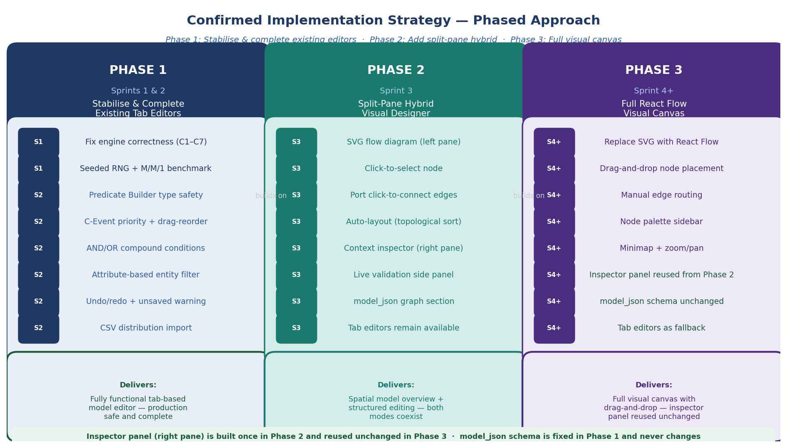
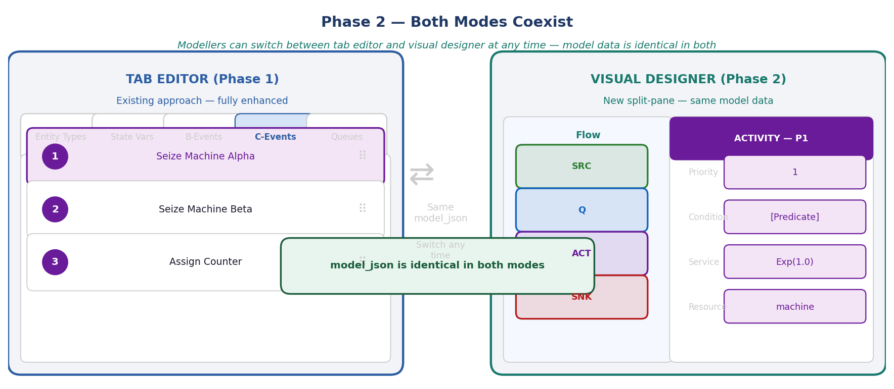
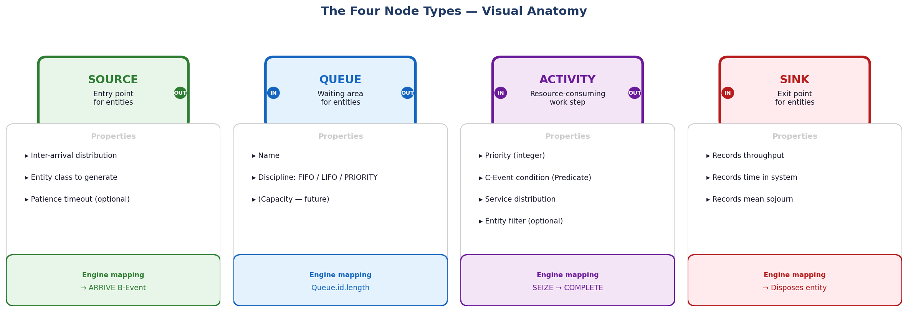
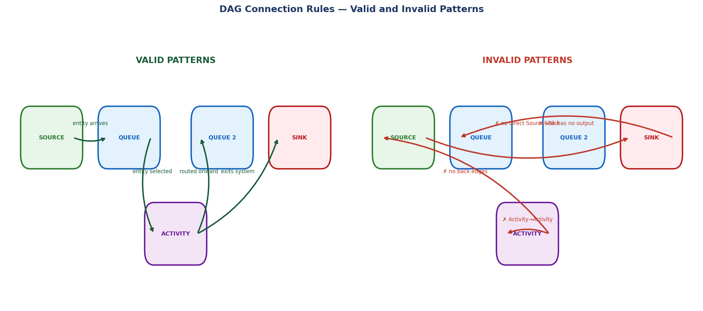

# DES Studio — Visual Designer: Confirmed Design
*Entity Lifecycle Designer — Authoring Modes and Visual Designer Plan*
*Current version: 3.1 | Last updated: 2026-05-05*

---

## Version History

| Version | Date | Author | Change |
|---|---|---|---|
| 1.0 | 2026-04-30 | — | Initial design document — three options presented for review |
| 2.0 | 2026-04-30 | — | Decision confirmed: phased approach. Tab editors (Phase 1) → Split-pane hybrid (Phase 2) → React Flow canvas (Phase 3). Coexistence of both modes documented. |
| 3.0 | 2026-05-04 | — | ADR-007 accepted: DES Studio has three authoring modes over one canonical `model_json`. The split-pane SVG hybrid phase is retired; the visual designer should be planned as the final graph-first authoring surface. |
| 3.1 | 2026-05-05 | — | ADR-010 accepted: Sprint 9 uses `@xyflow/react`; `model_json.graph` is optional layout metadata only; visual topology is derived from canonical model logic; SVG Phase 2 prompts remain historical only. |
| | | | *(add a row each time this document is updated)* |

> **How to update this document:** When a design decision changes, a phase completes, or a new constraint is discovered — add a row to the version history above, increment the version number in the title, and update the relevant section. Do not delete previous content — mark superseded sections as `[Superseded in v X.X — see Section Y]`.

---

## Decision Record

**Confirmed approach:** DES Studio supports three first-class authoring modes over one canonical `model_json`:

1. Forms/Tabs
2. AI Generated Model
3. Visual Designer

This decision is recorded in `docs/decisions/ADR-007-three-authoring-modes.md`.

Sprint 9A dependency and graph metadata decisions are recorded in `docs/decisions/ADR-010-visual-designer-canvas-graph-metadata.md`.

The previous v2.0 plan to build a split-pane SVG hybrid designer before the final visual designer is superseded. The SVG hybrid is no longer a required bridge phase. When visual graph authoring is scheduled, it should be planned as the final graph-first designer rather than a temporary renderer.

This is directly aligned with the audit's recommendation:

> *"A full rebuild would discard working, tested engine code in exchange for nothing. A selective rebuild... combined with adding the absent features in prioritised sprints — is the correct path."*

The same principle applies to the UI: the existing tab editors are working and remain first-class. AI generation and the visual designer are additive authoring surfaces over the same model data, not replacement formats.

**Sprint 9A accepted decisions:**

- Use `@xyflow/react` for the final graph-first Visual Designer.
- Allow the required vendor stylesheet `@xyflow/react/dist/style.css` as a narrow exception; DES Studio-owned styles still use inline token-driven style objects.
- Persist `model_json.graph` only as optional visual layout metadata.
- Derive graph topology from canonical DES model logic rather than storing a second graph model.
- Reuse small editor building blocks in the inspector; do not embed full tab editors inside graph nodes.

---

## Contents

1. [The Authoring Strategy](#1-the-authoring-strategy)
2. [What Coexistence Means](#2-what-coexistence-means)
3. [The Four Node Types](#3-the-four-node-types)
4. [DAG Rules and Validation](#4-dag-rules-and-validation)
5. [Phase 1 — Complete the Tab Editors (Sprints 1 and 2)](#5-phase-1--complete-the-tab-editors-sprints-1-and-2)
6. [Phase 2 — Split-Pane Hybrid Designer (Sprint 3)](#6-phase-2--split-pane-hybrid-designer-sprint-3)
7. [Phase 3 — Full React Flow Canvas (Sprint 4+)](#7-phase-3--full-react-flow-canvas-sprint-4)
8. [The Inspector Panel — Built Once, Reused Twice](#8-the-inspector-panel--built-once-reused-twice)
9. [model_json Schema — Fixed in Phase 1, Never Changes](#9-model_json-schema--fixed-in-phase-1-never-changes)
10. [Phase 2 — Detailed Design](#10-phase-2--detailed-design)
11. [Phase 3 — Detailed Design](#11-phase-3--detailed-design)
12. [Claude Code Prompts by Phase](#12-claude-code-prompts-by-phase)

---

## 1. The Authoring Strategy

[Supersedes v2.0 phased SVG hybrid strategy — see ADR-007.]

DES Studio has one canonical model format and three authoring modes.

| Authoring mode | Purpose | Canonical data |
|---|---|---|
| Forms/Tabs | Precise manual construction and editing | Reads and writes `model_json` directly |
| AI Generated Model | Natural-language model creation and refinement | Proposes validated `model_json` before apply |
| Visual Designer | Graph-first lifecycle modelling | Reads and writes the same `model_json`, with optional layout-only graph metadata |

The authoring modes are not separate products and do not create separate schemas. Validation, persistence, import/export, run history, execution, and results analysis all operate on the same model object.

`model_json.graph` is not a separate model. It stores optional layout state such as node positions and viewport. If missing or stale, it is regenerated from canonical model data.

### Retired v2.0 phased strategy

The original v2.0 phased strategy is preserved below for history, but it is no longer current implementation guidance.


*Figure 1: Three-phase implementation strategy. Each phase builds on the previous. The inspector panel is built once in Phase 2 and reused unchanged in Phase 3.*

The strategy has three phases with a clear dependency chain.

### Phase 1 — Complete the Tab Editors (Sprints 1 and 2)

Fix all engine correctness issues and complete every missing feature in the existing tab-based editors. At the end of Phase 1 the tab editors are production-quality. This is the foundation everything else builds on.

**Why first:** The Predicate Builder, DistPicker, entity filter, and resource picker that the visual designer's inspector panel will use are built and tested here. Building the inspector panel before the components it contains are correct would mean rebuilding it.

**Status:** ✅ Complete in the main build plan. The tab editor is the current stable manual authoring mode.

### Phase 2 — Split-Pane Hybrid Designer (Sprint 3)

[Superseded in v3.0 by ADR-007 — do not implement this as a required bridge phase.]

Add a lightweight SVG flow diagram alongside the existing tab editors. The modeller can see the model as a connected graph and click any node to edit it in an inspector panel on the right. The tab editors remain fully functional. Both modes read and write the same `model_json`.

**Why second:** This delivers the spatial overview the specification requires without discarding the existing editors. The SVG diagram is simple enough to build in one sprint. The inspector panel reuses the components built in Phase 1 — no duplication.

**Status:** Superseded by ADR-007 — do not implement as a required bridge phase

### Phase 3 — Full React Flow Canvas (Sprint 4+)

[Superseded in v3.0 as a phase number. ADR-010 confirms `@xyflow/react` as the Sprint 9 canvas dependency for the final Visual Designer authoring mode.]

Build the final graph-first canvas with `@xyflow/react` — drag-and-drop node placement, manual edge routing, minimap, zoom/pan. The inspector uses existing editor building blocks where practical. The canonical `model_json` schema remains the source of truth. The tab editors remain first-class.

**Why third:** React Flow integration is a significant dependency addition. By the time Phase 3 begins, the inspector panel is already complete and tested — only the diagram renderer changes.

**Status:** Sprint 9 target — no longer dependent on Phase 2 SVG completion

---

## 2. What Coexistence Means


*Figure 2: Both modes use identical model_json. Switching between them at any time preserves all model data.*

Coexistence means four concrete things.

**The model data is the same.** Whether a modeller uses the tab editor or the visual designer, they are reading and writing the same `model_json` object in Supabase. There is no conversion, no export/import, no format difference.

**AI proposals are model proposals, not a separate format.** The AI Generated Model mode returns a proposed canonical model JSON object. It must pass validation before the user can apply it.

**Authoring modes are always available once implemented.** A modeller can create or edit using forms/tabs, ask AI to generate or refine a model, or use the visual designer. The data remains consistent throughout.

**No authoring mode deprecates another.** Some modellers prefer spatial graph modelling. Others prefer the precision of tab editors, particularly for complex C-Event conditions with many AND/OR clauses. AI generation is an assistant, not an authority; users review before applying.

---

## 3. The Four Node Types

Every node in the visual designer corresponds to a model element with a defined engine mapping.


*Figure 3: Visual anatomy of the four node types — each with its properties panel and engine mapping.*

| Node | Visual Identity | Engine Phase | Ports |
|---|---|---|---|
| **Source** | Green · rounded rectangle | B-Event: ARRIVE | Output only |
| **Queue** | Blue · rounded rectangle | Passive | Input + Output |
| **Activity** | Purple · rounded rectangle | C-Event: SEIZE + B-Event: COMPLETE | Input + Output |
| **Sink** | Red · rounded rectangle | Records KPIs · disposes entity | Input only |

### Port rules

- **Source:** one output port only — nothing connects to a Source input
- **Sink:** one input port only — nothing connects from a Sink output
- **Queue and Activity:** one input port + one output port each
- A single output port connects to exactly one input port
- Multiple Activities may route to the same Sink (fan-in to Sink is permitted)
- Activity to Activity direct connection is blocked — a Queue must sit between activities

---

## 4. DAG Rules and Validation

The model must be a Directed Acyclic Graph. These rules are enforced in real time in the visual designer and at validation time in the tab editor.


*Figure 4: Valid and invalid DAG connection patterns. Invalid connections are blocked before they are drawn.*

### Blocking rules — connection is prevented

| Rule | Reason |
|---|---|
| No back-edges (Activity → Source, Queue → Source) | Creates a cycle — engine loop |
| No Sink output connections | Sink is terminal |
| No Activity → Activity direct connection | Entities have nowhere to wait |
| No Source → Sink direct connection | Entity bypasses all processing |
| No disconnected nodes | Every node must be reachable from Source and reach Sink |

### Warning rules — flagged but run is not blocked

| Rule | Reason |
|---|---|
| Activity with no condition set | C-Event will never fire |
| Queue with no Activity connected downstream | Entities fill queue with no service |

---

## 5. Phase 1 — Complete the Tab Editors (Sprints 1 and 2)

**Status:** ✅ Complete in the main build plan
**Started:** 2026-05-03
**Completed:** 2026-05-03
**Notes:** Forms/tabs are the stable manual authoring mode. Keep this section as historical traceability for the original visual-designer dependency plan.

Phase 1 is entirely covered by the existing sprint plan. Follow the build plan prompts for Sprints 1 and 2 from `docs/DES_Studio_Build_Plan.md`.

### What Phase 1 delivers

**Sprint 1 — Engine safety (fixes to existing files):**

| Fix | File | Audit ref | Status |
|---|---|---|---|
| Replace `new Function()` with safe evaluator | `conditions.js`, `macros.js` | C1 | ✅ |
| Fix C-scan restart rule | `engine/index.js:121` | C3 | ✅ |
| Implement LIFO and Priority queue discipline | `entities.js:84` | C2 | ✅ |
| Add seeded RNG (`mulberry32`) | `distributions.js` | C7 | ✅ |
| Pre-run model validation (V1–V11) | `execute/index.jsx` | C5 | ✅ |
| Surface Phase C truncation warning | `engine/index.js` | C4 | ✅ |
| Fix M/M/1 benchmark (Fixed → Exponential) | `tests/` | — | ✅ |

**Sprint 2 — Editor completeness (extensions to existing files):**

| Feature | File | Status |
|---|---|---|
| Predicate Builder operator filtering by `valueType` | `editors/index.jsx` | ✅ |
| Compound AND/OR conditions | `editors/index.jsx` | ✅ |
| Attribute-based entity filter | `editors/index.jsx` + `entities.js` | ✅ |
| Explicit C-Event priority field + drag-to-reorder | `editors/index.jsx` | ✅ |
| Undo/redo history stack | `editors/index.jsx` | ✅ |
| Unsaved-change warning on navigation | `App.jsx` | ✅ |
| DistPicker CSV import | `shared/components.jsx` | ✅ |

### Phase 1 exit gate

Phase 2 must not begin until all of the following pass:

```bash
npm test -- --run                       # zero failures
node tests/[benchmark-file]             # M/M/1 exits 0
npm run build                           # production build succeeds
```

### Why Phase 1 must be complete before Phase 2

The Predicate Builder built in Sprint 2 is the central component of the visual designer's inspector panel. If it is not type-safe and fully functional before Phase 2 begins, the inspector panel will be built on a broken foundation. Complete Phase 1 fully, confirm its tests pass, then start Phase 2.

---

## 6. Phase 2 — Split-Pane Hybrid Designer (Sprint 3)

**Status:** Superseded by ADR-007
**Started:** —
**Completed:** —
**Notes:** Do not implement this as a required bridge phase. Preserve this section only as historical design context.

### Layout

```
┌──────────────────────────────────────────────────────────────────────────┐
│  HEADER BAR                                                              │
│  ← Back  ·  [Model Name]  ·  ● Saving  ·  [Tab ⊞] [Visual ⧉]  ·  ▶ Run │
├─────────────────────────────────────┬────────────────────────────────────┤
│                                     │                                    │
│   FLOW DIAGRAM  (left · 40%)        │   INSPECTOR PANEL  (right · 60%)  │
│                                     │                                    │
│   SVG graph — auto-layout           │   Context-sensitive editor         │
│                                     │   for the selected node            │
│   [SOURCE] → [QUEUE] → [ACTIVITY]  │                                    │
│                         ↑ selected  │   ACTIVITY — machine_alpha         │
│                         (dashed     │   ─────────────────────────────    │
│                          border)    │   ○ Logic  ○ Distribution          │
│                                     │   ○ Resource                       │
│   [+ Source] [+ Queue]              │   ─────────────────────────────    │
│   [+ Activity] [+ Sink]             │   Priority:    [ 1 ]               │
│                                     │   Condition:   [Predicate Builder] │
│   Validation:                       │   Service:     [DistPicker]        │
│   ✓ Acyclic · ✓ Connected           │   Entity filter: [optional pred.]  │
│   ⚠ Activity "Beta" no condition    │   Resource:    [machine_alpha ▼]   │
│                                     │                                    │
│                                     │   [Save]   [▶ Run]                 │
└─────────────────────────────────────┴────────────────────────────────────┘
```

### Features

| Feature | File | Status |
|---|---|---|
| F3.1 — graph section in model_json + migration | `db/models.js`, `editors/index.jsx` | ⬜ |
| F3.2 — SVG FlowDiagramSVG component | `editors/FlowDiagramSVG.jsx` (new) | ⬜ |
| F3.3 — Port click-to-connect with DAG validation | `FlowDiagramSVG.jsx` | ⬜ |
| F3.4 — InspectorPanel component | `editors/InspectorPanel.jsx` (new) | ⬜ |
| F3.5 — Mode toggle (Tab / Visual) in ModelDetail | `editors/index.jsx` | ⬜ |
| F3.6 — Validation panel below flow diagram | `FlowDiagramSVG.jsx` | ⬜ |

### What is new in Phase 2

Only three things are genuinely new. Everything else reuses Phase 1 work.

| New in Phase 2 | Reused from Phase 1 |
|---|---|
| SVG flow diagram component | Predicate Builder (complete, type-safe) |
| Auto-layout algorithm | DistPicker (complete, with CSV import) |
| Mode toggle (Tab / Visual) | Entity filter picker |
| | Validation logic (V1–V11) |
| | ConditionBuilder (compound AND/OR) |
| | All existing editor tab components |

### The FlowDiagram props interface — designed for Phase 3 from the start

The SVG diagram component uses a props interface that is **identical to what the React Flow implementation will receive in Phase 3**. This means Phase 3 is a renderer substitution — the rest of the application does not change.

```javascript
// This interface is fixed in Phase 2 and never changes
<FlowDiagram
  nodes={model.graph.nodes}           // { id, type, x, y, label, sublabel }[]
  edges={model.graph.edges}           // { id, from, to }[]
  selectedNodeId={selectedNodeId}     // string | null
  onNodeSelect={handleNodeSelect}     // (nodeId) => void
  onNodeAdd={handleNodeAdd}           // (type) => void
  onNodeDelete={handleNodeDelete}     // (nodeId) => void
  onEdgeAdd={handleEdgeAdd}           // ({ from, to }) => void
  onEdgeDelete={handleEdgeDelete}     // (edgeId) => void
  validationErrors={validationErrors} // { nodeId, message, severity }[]
/>
```

### Auto-layout algorithm

```
1. Find Source node (no incoming edges)
2. BFS traversal from Source
3. Assign column = BFS depth, row = order within column
4. Multiply by spacing constants (220px horizontal, 120px vertical)
5. Store x, y in model.graph.nodes
```

Manual node positioning is not supported in Phase 2. This is a deliberate scope limit — added in Phase 3 via React Flow's `onNodeDragStop`.

### Mode toggle

```javascript
// In ModelDetail — component state only, not persisted
const [mode, setMode] = useState('tabs'); // default to existing behaviour
```

Switching modes never causes model data changes. Both modes read the same `model_json` record.

### Phase 2 exit gate

```bash
npm test -- --run                       # zero failures including new Phase 2 tests
npm run build                           # succeeds
# Manual: switch between Tab and Visual modes — confirm identical model data
# Manual: create a cycle — confirm it is blocked
# Manual: Activity inspector shows full Predicate Builder from Phase 1
```

---

## 7. Phase 3 — Full React Flow Canvas (Sprint 4+)

**Status:** Superseded as a phase number; visual designer still planned as a future authoring mode
**Started:** —
**Completed:** —
**Notes:** The phase number is superseded by ADR-007. The React Flow/canvas direction remains valid for the final Visual Designer authoring mode, but it is no longer dependent on an SVG hybrid predecessor.

The final Visual Designer should use a graph-first canvas. The old v2.0 text below assumes it replaces an SVG `FlowDiagram`; under ADR-007, it should instead be planned directly against the canonical `model_json` and any required graph layout metadata.

### What changes and what does not

| Changes in Phase 3 | Unchanged in Phase 3 |
|---|---|
| Final `FlowDiagramReactFlow.jsx` built directly | Canonical model_json remains the source of truth |
| `@xyflow/react` added to `package.json` | Forms/Tabs and AI Generated Model remain first-class |
| Drag-and-drop node placement | model_json schema |
| Manual edge routing | Predicate Builder |
| Node palette sidebar | DistPicker |
| MiniMap + zoom/pan | Validation logic |
| Manual node repositioning | Tab editors (remain as fallback) |
| | All engine code |
| | All DB layer code |

### One line changes in the application

```javascript
// Sprint 9 import in the Visual Designer shell:
import { FlowDiagramReactFlow } from './FlowDiagramReactFlow';
```

Everything else in `ModelDetail` is identical.

### Custom node components

```javascript
const SourceNode = ({ data, selected }) => (
  <div style={{ background: '#E8F5E9', border: `${selected ? 3 : 2}px ${selected ? 'dashed' : 'solid'} #2E7D32`,
                borderRadius: 8, padding: '8px 16px' }}>
    <strong style={{ color: '#2E7D32' }}>{data.label}</strong>
    <div style={{ fontSize: 11, color: '#2E7D32' }}>{data.sublabel}</div>
    <Handle type="source" position={Position.Right} />
  </div>
);
```

All styling uses inline objects consistent with the codebase (no CSS classes, tokens from `tokens.js`).

### Phase 3 exit gate

```bash
npm test -- --run                       # zero failures
npm run build                           # succeeds
# Manual: drag-and-drop node from palette — confirm positions saved to model_json
# Manual: Tab editors still function correctly after Phase 3
# Manual: Inspector panel identical to Phase 2
```

---

## 8. The Inspector Panel — Built Once, Reused Twice

The inspector panel is built in Phase 2 using existing Phase 1 components and survives Phase 3 completely unchanged.

### What the inspector panel shows by node type

| Selected node | Components shown |
|---|---|
| None | "Click a node in the diagram to edit its properties." |
| Source | Entity class picker + DistPicker (inter-arrival) + optional DistPicker (patience) |
| Queue | Name field + discipline dropdown (FIFO / LIFO / PRIORITY) |
| Activity | Priority integer + ConditionBuilder + entity filter + queue rule + DistPicker + resource picker |
| Sink | Name field (read-only stats display) |

### Why it survives Phase 3 unchanged

The inspector panel receives `selectedNodeId` (a string) and `model_json`. It has no dependency on how the diagram works — SVG or React Flow. Whether `selectedNodeId` is set by a click on an SVG rect or by React Flow's `onSelectionChange` is irrelevant. The interface contract is the same.

---

## 9. model_json Schema — Canonical Model Plus Optional Layout

The canonical DES model remains the existing `model_json` sections: `entityTypes`, `stateVariables`, `bEvents`, `cEvents`, and `queues`.

The Visual Designer may persist an optional `graph` section, but that section is layout metadata only. It is not required to run a model and it must not contain simulation logic.

```json
{
  "entityTypes": [...],
  "stateVariables": [...],
  "bEvents": [...],
  "cEvents": [...],
  "queues": [...],

  "graph": {
    "version": 1,
    "nodes": [
      { "id": "source:patient-arrival", "type": "source", "refId": "patient-arrival", "x": 80, "y": 180 },
      { "id": "queue:triage", "type": "queue", "refId": "triage", "x": 320, "y": 180 },
      { "id": "activity:start-triage", "type": "activity", "refId": "start-triage", "x": 560, "y": 180 },
      { "id": "sink:complete", "type": "sink", "refId": null, "x": 800, "y": 180 }
    ],
    "viewport": { "x": 0, "y": 0, "zoom": 1 }
  }
}
```

`node.refId` points to the corresponding canonical model element where one exists. `source` and `sink` nodes may be derived visual lifecycle concepts rather than standalone engine schema elements.

Persisted graph edges are avoided by default. Edges are derived from canonical DES model logic so they cannot drift from actual routing.

### Migration for existing models

Models created before Sprint 9 have no `graph` section. When the visual designer opens such a model, `deriveGraphFromModel(modelJson)` generates visual nodes and edges from the canonical model. If the user moves nodes, the layout positions are saved back into `model_json.graph`.

### Node mapping

| Visual node | Canonical source of truth |
|---|---|
| Source | Arrival B-event with `ARRIVE(CustomerType, QueueName)` |
| Queue | `queues[]` |
| Activity | Service-start C-event plus scheduled completion B-event |
| Sink | Terminal completion/routing outcome, initially derived rather than a new engine schema element |

### Round-trip rules

- Forms/Tabs edit canonical `model_json`.
- AI Generated Model proposes canonical `model_json`.
- Visual Designer edits canonical `model_json`.
- `model_json.graph` can be regenerated at any time.
- Visual connections update canonical model routing first, then refresh derived graph edges.
- `validateModel()` remains the execution gate.

---

## 10. Phase 2 — Detailed Design

[Superseded in v3.1 by ADR-010 — historical reference only. Do not implement the SVG bridge.]

### Node visual specification

```
┌──────────────────────────────┐
│ ●                            │  ← input port (filled circle, node colour)
│   [Node Name]                │  ← bold, 10px, node colour
│   [Sublabel]                 │  ← 8px, node colour
│                            ● │  ← output port (filled circle, node colour)
└──────────────────────────────┘

Selected:  3px dashed border in node colour
Hover:     2px solid border, pointer cursor
Error:     red dashed border, ✗ icon top-right
```

| Node type | Border | Fill |
|---|---|---|
| Source | `#2E7D32` | `#E8F5E9` |
| Queue | `#1565C0` | `#E3F2FD` |
| Activity | `#6A1B9A` | `#F3E5F5` |
| Sink | `#B71C1C` | `#FFEBEE` |

### Edge visual specification

- SVG cubic bezier paths from output port to input port
- Edge colour matches source node type
- 2px width, 8px arrowhead
- Selected edge: 3px, delete button on hover

### Validation panel specification

| State | Display |
|---|---|
| All valid | Green background · "Model is valid — N nodes, N edges" |
| Warning | Amber background · "[node name]: [message]" · clicking highlights node |
| Error | Red background · "[node name]: [message]" · Run button disabled |

---

## 11. Phase 3 — Detailed Design

### Sprint 9 Canvas: `@xyflow/react`

Sprint 9 implements the final graph-first Visual Designer directly with `@xyflow/react`. Do not install the older `reactflow` package name.

Required imports:

```javascript
import { ReactFlow, MiniMap, Controls, Background, Handle, Position } from '@xyflow/react';
import '@xyflow/react/dist/style.css';
```

The stylesheet import is a vendor-CSS exception accepted by ADR-010. DES Studio-owned node styling remains inline and token-driven.

### New file: `FlowDiagramReactFlow.jsx`

```javascript
import { ReactFlow, MiniMap, Controls, Background, Handle, Position } from '@xyflow/react';
import '@xyflow/react/dist/style.css';

export const FlowDiagramReactFlow = ({
  nodes, edges, selectedNodeId,
  onNodeSelect, onNodeAdd, onNodeDelete,
  onEdgeAdd, onEdgeDelete, validationErrors
}) => {
  const rfNodes = nodes.map(n => ({
    id: n.id, type: n.type, position: { x: n.x, y: n.y },
    data: { label: n.label, sublabel: n.sublabel,
            error: validationErrors.find(e => e.nodeId === n.id) }
  }));

  const rfEdges = edges.map(e => ({ id: e.id, source: e.from, target: e.to }));

  return (
    <ReactFlow
      nodes={rfNodes} edges={rfEdges}
      onSelectionChange={({ nodes }) => onNodeSelect(nodes[0]?.id ?? null)}
      onConnect={({ source, target }) => onEdgeAdd({ from: source, to: target })}
      onEdgesDelete={deleted => deleted.forEach(e => onEdgeDelete(e.id))}
      onNodeDragStop={(_, node) => { /* update x,y in model.graph.nodes */ }}
      nodeTypes={nodeTypes}
    >
      <MiniMap /> <Controls /> <Background />
    </ReactFlow>
  );
};
```

`nodes` and `edges` passed to the diagram are derived view objects. Persisted `model_json.graph.nodes` supplies positions only; edge topology is refreshed from canonical model logic.

### Node palette (new in Phase 3)

```
LEFT SIDEBAR
┌──────────┐
│  Nodes   │
├──────────┤
│ [SOURCE] │  ← draggable
│ [QUEUE ] │  ← draggable
│ [ACTIV.] │  ← draggable
│ [SINK  ] │  ← draggable
└──────────┘
```

---

## 12. Claude Code Prompts by Phase

[Superseded in v3.1 by Sprint 9 planning in `docs/DES_Studio_Build_Plan.md`. Prompts below are historical unless explicitly marked current.]

### Phase 1 — Sprints 1 and 2

No new prompts needed. Follow the existing Sprint 1 and Sprint 2 prompts in `docs/DES_Studio_Build_Plan.md` exactly.

---

### Phase 2 — Sprint 3 Planning Prompt *(run in claude.ai)*

[Historical only — do not use for Sprint 9. The SVG hybrid bridge is retired.]

```
We are starting Sprint 3 of DES Studio.

Completed in Sprints 1–2: [paste completed feature list]

Sprint 3 goal: Add the split-pane visual designer alongside the
existing tab editors. Both modes must coexist — the same model_json
is read and written by both.

CONFIRMED DECISIONS:
  1. Tab editors are NOT removed — they remain fully functional
  2. A mode toggle switches between Tab and Visual views
  3. Visual designer uses SVG — NOT React Flow (that is Phase 3)
  4. Inspector panel reuses Phase 1 components — not rewritten
  5. Auto-layout only — no manual drag repositioning in Phase 2
  6. FlowDiagram props interface is renderer-agnostic (fixed for Phase 3)
  7. model_json graph section added in this sprint

Features:
  F3.1 — graph section in model_json + migration for existing models
  F3.2 — SVG FlowDiagramSVG component with auto-layout
  F3.3 — Port click-to-connect with DAG validation
  F3.4 — InspectorPanel component (reuses Phase 1 components)
  F3.5 — Mode toggle in ModelDetail header
  F3.6 — Validation panel below flow diagram

Definition of done:
  - Both modes show identical model data
  - Switching between modes preserves all edits
  - DAG cycles cannot be created
  - Activity inspector shows full Predicate Builder from Phase 1
  - Tab editors remain fully functional and unchanged
  - npm test -- --run passes
  - npm run build succeeds
```

---

### Phase 2 — F3.1: graph section in model_json

[Historical only — do not use for Sprint 9. Use ADR-010 graph metadata rules instead.]

```
Re-read CLAUDE.md. Task F3.1 of Sprint 3.

Read src/db/models.js — show me the current model_json structure.

Add a graph section to model_json:
  { "graph": {
      "nodes": [{ "id": "string", "type": "source|queue|activity|sink",
                  "label": "string", "x": number, "y": number }],
      "edges": [{ "id": "string", "from": "nodeId", "to": "nodeId" }]
  }}

Also implement generateGraphFromModel(modelJson) → graph:
  - Called when model_json has no graph section
  - BFS auto-layout: column = BFS depth, row = position in column
  - 220px horizontal · 120px vertical spacing
  - Creates edges from logical connections in existing model_json
  - Saves graph section to Supabase immediately

Data layer only — do not write FlowDiagram component yet.
Show me the schema and function before implementing.
```

---

### Phase 2 — F3.2: SVG FlowDiagramSVG component

[Historical only — do not use for Sprint 9. Do not build `FlowDiagramSVG`.]

```
Task F3.2 of Sprint 3.

Build src/ui/editors/FlowDiagramSVG.jsx with this EXACT props interface
(Phase 3 React Flow will implement the same interface — do not deviate):

  FlowDiagramSVG({ nodes, edges, selectedNodeId, onNodeSelect,
                   onNodeAdd, onNodeDelete, onEdgeAdd, onEdgeDelete,
                   validationErrors })

SVG implementation:
  - Nodes: rect with rounded corners, port circles left/right
  - Node colours: green/blue/purple/red per type (see Section 10)
  - Selected: 3px dashed border in node colour
  - Edges: cubic bezier SVG paths, arrowhead, coloured by source node
  - Port click-to-connect: output port → input port calls onEdgeAdd
    (pending connection in component state, dashed preview line)
  - DAG validation before calling onEdgeAdd — block cycles
  - [+ Source] [+ Queue] [+ Activity] [+ Sink] buttons below diagram

Before writing code, explain:
  1. How you will track pending edge connection state
  2. How you will validate DAG rules before calling onEdgeAdd

Do NOT use React Flow. SVG only.
```

---

### Phase 2 — F3.4: InspectorPanel component

[Historical only — inspect component reuse ideas only. Sprint 9 should build focused node inspectors over canonical model fields.]

```
Task F3.4 of Sprint 3.

Read src/ui/editors/index.jsx — identify:
  1. Predicate Builder and its current props
  2. DistPicker and its current props
  3. Entity filter section
  4. Resource dropdown and priority field

Build src/ui/editors/InspectorPanel.jsx:
  Props: { selectedNodeId, model, onChange }

Renders by selected node type:
  null     → "Click a node to edit its properties."
  source   → entity class picker + DistPicker (inter-arrival) + optional patience
  queue    → name field + discipline dropdown
  activity → priority integer + ConditionBuilder + entity filter
             + queue rule + DistPicker (service) + resource picker
  sink     → name field (read-only)

CRITICAL: Reuse existing Phase 1 components. Do NOT rewrite them.
Show me component tree and which existing components you will reuse
before writing any code.
```

---

### Phase 2 — F3.5: Mode Toggle

[Historical only — Sprint 9 mode entry should target the final Visual Designer, not a split-pane SVG bridge.]

```
Task F3.5 of Sprint 3.

Read src/ui/editors/index.jsx — show me ModelDetail's tab structure.

Add mode toggle to ModelDetail header: [Tab Editor ⊞]  [Visual Designer ⧉]
  const [mode, setMode] = useState('tabs');  // default tabs

'tabs' mode: render existing tab structure UNCHANGED
'visual' mode: split-pane — FlowDiagramSVG (40%) + InspectorPanel (60%)

Toggle must NOT modify model_json.
Switching must NOT lose unsaved changes.
Tab editor must be pixel-identical in 'tabs' mode.
```

---

### Sprint 9 — Current Planning Prompt *(run in claude.ai)*

```
We are planning Sprint 9 of the DES Studio visual designer.

ADR-007 and ADR-010 are accepted.

Sprint 9 implements the final graph-first Visual Designer directly.

Key decisions:
  - Use @xyflow/react, not the old reactflow package name
  - Import @xyflow/react/dist/style.css as the only vendor-CSS exception
  - Persist model_json.graph as optional layout metadata only
  - Derive visual edges from canonical model logic
  - Visual connections update canonical model_json first
  - Do not build FlowDiagramSVG as a bridge implementation

New in Sprint 9:
  - @xyflow/react added to package.json
  - FlowDiagramReactFlow.jsx
  - Custom node components (SourceNode, QueueNode, ActivityNode, SinkNode)
  - Node palette sidebar (drag-and-drop)
  - MiniMap, zoom/pan, manual node repositioning
  - Visual Designer mode entry in ModelDetail
  - Focused node inspector that reuses DistPicker, ConditionBuilder, EntityFilterBuilder, and option helpers

Definition of done:
  - Existing model opens in Visual Designer with derived graph
  - Visual edits update canonical model_json and appear in Forms/Tabs
  - Forms/Tabs edits are reflected when returning to Visual Designer
  - Invalid connections and cycles are blocked
  - npm test -- --run passes
  - npm run build succeeds
```

---

### Sprint 9 — Start Prompt for Claude Code

```
Re-read CLAUDE.md, ADR-007, ADR-010, and docs/DES_Studio_Visual_Designer_Design.md.
Sprint 9 implements the final graph-first Visual Designer with @xyflow/react.

Before writing any code:
  1. Read package.json — confirm @xyflow/react is not yet installed
  2. Read src/ui/ModelDetail.jsx — identify the current authoring tab shell
  3. Read src/ui/editors/index.jsx — identify reusable small editor components
  4. Read src/engine/validation.js — identify validation extension points

Then explain:
  1. How canonical model_json maps to visual Source/Queue/Activity/Sink nodes
  2. How derived edges are produced without storing routing logic in model_json.graph
  3. How @xyflow/react node/edge data maps back to canonical model changes
  4. How onNodeDragStop updates layout metadata only
  5. Which existing editor building blocks the inspector will reuse

Show the graph derivation contract and component signatures before implementing.
```

---

*End of document. Update version history when any section changes.*
