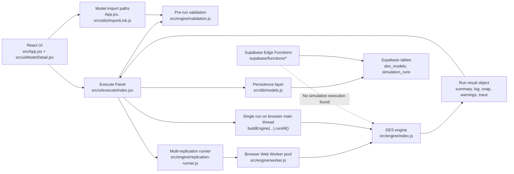

# DES Runtime Execution Map

Date: 2026-05-26

## Existing Benchmark Baseline

- Existing benchmark scripts found:
  - `tests/engine/mm1_benchmark.js`
  - `tests/engine/mmc_benchmark.js`
  - `tests/engine/perf_timing.js`
  - `package.json` script: `npm run bench` -> `vitest run tests/engine/benchmarks --environment node --reporter verbose`
- Existing benchmark fixtures/models found:
  - `tests/benchmarks/golden.test.js` is referenced in repo docs and sprint closure material
  - Engine templates and sample scenarios exist in `src/engine/templates.js`
  - Example/sample model assets exist, including `docs/examples/` and CSV samples at repo root
- Existing performance docs found:
  - `docs/performance-envelope.md`
  - `docs/reviews/sprint-72-performance-optimisation-plan.md`
  - `docs/reviews/sprint-72-performance-optimisation-closure.md`
  - `docs/reviews/sprint-29-closure-report.md`
- Existing runtime metrics found:
  - Engine result summary and run payload fields in `src/engine/index.js`
  - Replication aggregate stats in `src/ui/execute/index.jsx`
  - Saved run payloads in `src/db/models.js`
  - No dedicated persisted runtime-cost metrics such as `events_processed` or `c_event_scans` found yet
- Existing test coverage related to performance:
  - Replication confidence interval gate: `tests/engine/replication-ci.test.js`
  - Worker orchestration tests: `tests/engine/replication-runner.test.js`
  - Analytical correctness gates: `tests/engine/mm1_benchmark.js`, `tests/engine/mmc_benchmark.js`
- Gaps compared with the requested benchmark/sizing goal:
  - Existing benchmarks validate correctness and broad timing envelope, but do not yet map runtime location, persistence boundaries, or cloud execution responsibilities
  - Existing saved run records do not appear to persist workload counters such as `events_processed`, `c_event_scans`, or FEL size

## Executive Answer

The DES simulation engine currently runs in the client-side JavaScript application, not in Supabase Edge Functions and not in Cloudflare Workers.

- Single-run execution happens directly in the browser main thread via `buildEngine(...).runAll()` in `src/ui/execute/index.jsx`.
- Multi-replication execution happens in browser Web Workers orchestrated by `src/engine/replication-runner.js`, with each worker calling `buildEngine(...).runAll()` through `src/engine/worker.js`.
- Supabase is used for model persistence, run-history persistence, and several non-simulation edge functions.
- No Cloudflare Worker implementation was found in the repository.

## High-Level Architecture

## Answers To The Requested Questions

### 1. Where is simulation work executed?

Simulation work is executed locally in JavaScript:

- Browser main thread for single runs:
  - `src/ui/execute/index.jsx:571-580`
- Browser Web Workers for multi-replication batches:
  - `src/ui/execute/index.jsx:452-460`
  - `src/engine/replication-runner.js:10-15`
  - `src/engine/worker.js:16-31`

Evidence:

- `src/engine/index.js:340` exports `buildEngine(...)`
- `src/engine/index.js:907-948` implements `runAll()`
- `src/engine/worker.js:16-31` builds the engine and runs one replication payload
- `src/engine/replication-runner.js:188-201` posts model + seed + limits to workers

What was not found:

- No Cloudflare Worker code or config
- No server-side simulation runner in `supabase/functions/`
- No Edge Function invoking `buildEngine()` or `runReplications()`

### 2. Which files/functions start a simulation run?

Primary UI entry point:

- `src/ui/execute/index.jsx`
  - `initEngine()` prepares a step-through session via `buildEngine(...)`: `src/ui/execute/index.jsx:216-233`
  - `doRunAll()` starts a full run
  - Single-run path calls `buildEngine(...).runAll()`: `src/ui/execute/index.jsx:571-580`
  - Replication path calls `runReplications(...)`: `src/ui/execute/index.jsx:452-460`

Supporting UI entry points:

- `src/ui/execute/index.jsx:692-696`
  - Optional `autoRun` starts execution automatically when a model opens in execute mode
- `src/App.jsx:368`
  - Some flows open a model with `initialTab: "execute"` and `autoRun: true`
- `src/ui/ModelDetail.jsx:1112-1127`
  - Wires `autoRun` into `ExecutePanel`

Replay/re-run path:

- `src/ui/ModelHistoryTab.jsx:139`
  - Rebuilds an engine from saved state when replaying a prior run

### 3. Which code paths execute replications?

Browser orchestration:

- `src/ui/execute/index.jsx:434-540`
  - Batch mode when `replications > 1`
  - Calls `runReplications(...)`
  - Aggregates payloads as they finish
  - Builds a batch result and saves it after completion

Worker-pool orchestration:

- `src/engine/replication-runner.js:68-227`
  - Determines worker-pool size
  - Schedules replications
  - Derives per-replication seeds as `baseSeed + replicationIndex`: `src/engine/replication-runner.js:135-136`
  - Emits progress and supports cancellation

Worker execution:

- `src/engine/worker.js:3-31`
  - `runReplicationPayload(...)`
  - Calls `buildEngine(...)`
  - Returns `engine.runAll()`

Fallback path:

- `src/engine/replication-runner.js:11-17`
  - If `Worker` is unavailable, the app falls back to an inline pseudo-worker
- `src/engine/replication-runner.js:17-46`
  - This still runs locally in JS, not in Supabase or another cloud runtime

### 4. Which code paths save run results?

UI save triggers:

- Single run save:
  - `src/ui/execute/index.jsx:595-620`
- Step-through completion save:
  - `src/ui/execute/index.jsx:319-348`
- Replication batch save:
  - `src/ui/execute/index.jsx:497-527`

Persistence layer:

- `src/db/models.js:351-413`
  - `saveSimulationRun(modelId, userId, result, config)`
  - Inserts a row into `simulation_runs`
- `src/db/models.js:454-473`
  - `fetchRunHistory(...)`
- `src/db/models.js:518-541`
  - `getRun(...)`

Saved payload characteristics:

- `results_json` stores the detailed result object and batch metadata: `src/db/models.js:353-386`
- Top-level relational columns also store summary stats such as served, reneged, avg wait, and replications: `src/db/models.js:388-404`

### 5. Which code paths validate or import models?

Client-side validation before running:

- `src/ui/execute/index.jsx:187-202`
  - Calls `validateModel(...)`
  - Blocks run if validation errors exist
- `src/engine/validation.js:14`
  - Main validator entry point

Client-side import flows:

- File/JSON import in app shell:
  - `src/App.jsx:260-287`
  - `src/App.jsx:307-330`
  - Both call `extractImportedModelPayload(...)`, then `validateModel(...)`, then `saveModel(...)`
- Magic-link import:
  - `src/utils/importLink.js:31-45`
  - Decodes model JSON from URL hash, then validates via `validateModel(...)`

Server-side import path:

- `supabase/functions/import-model/index.ts`
  - Normalizes and validates a posted model server-side: `supabase/functions/import-model/index.ts:16-180`
  - Persists the imported model to `des_models`: `supabase/functions/import-model/index.ts:242-283`

Important distinction:

- Import validation exists both client-side and in the `import-model` Edge Function
- Simulation execution itself was not found in the import Edge Function

### 6. Are any long-running CPU-heavy operations inside Supabase Edge Functions or Cloudflare Workers?

No simulation-style CPU-heavy execution was found in Supabase Edge Functions or Cloudflare Workers.

Supabase Edge Functions present in the repo:

- `supabase/functions/import-model/index.ts`
  - Parses, normalizes, validates, and inserts models
  - Potentially moderate CPU for large payloads, but not a simulation runner
- `supabase/functions/llm-proxy/index.ts`
  - Primarily request normalization, rate limiting, config lookup, and proxying outbound LLM calls
  - Network-bound rather than DES CPU-bound
- `supabase/functions/notify-feedback/index.ts`
  - Notification workflow
- `supabase/functions/notify-new-signup/index.ts`
  - Notification workflow

Cloudflare:

- No Cloudflare Worker source, config, or runtime entry point was found in this repository scan

### 7. Are there implicit assumptions that runs are small or quick?

Yes. The current architecture contains several signs that execution is expected to stay within browser-friendly limits.

Evidence and implications:

- Single-run path blocks on `engine.runAll()` in the main thread:
  - `src/ui/execute/index.jsx:571-580`
  - Large runs can freeze the UI because this path is not workerized
- Replication concurrency is capped conservatively:
  - `src/engine/replication-runner.js:3-7`
  - Pool size is `min(replications, max(1, cores - 1), 4)`, implying caution about client resource pressure
- Cancellation exists only for replication batches, not for single main-thread `runAll()`:
  - `src/engine/replication-runner.js:218-225`
- Run history fetch is small and UI-oriented:
  - `src/db/models.js:456-462` limits history queries to 20 rows
- Saved results are written as a full `results_json` blob:
  - `src/db/models.js:353-401`
  - Large logs, traces, and per-replication payloads can make row size and client memory usage grow quickly
- Replication results are compacted to drop log payloads:
  - `src/engine/replication-runner.js:49-65`
  - This is a strong signal that result size and browser memory are already a concern
- Existing historical note documents memory pressure from unbounded test runs:
  - `AGENTS.md` section 22.1 describes prior worker memory exhaustion caused by open-ended runs

## Key Files And Responsibilities

| File | Responsibility |
|---|---|
| `src/ui/execute/index.jsx` | Main runtime UI. Validates models, starts runs, starts replication batches, collects results, persists run history. |
| `src/engine/index.js` | Core DES engine. `buildEngine(...)` and `runAll()` live here. |
| `src/engine/replication-runner.js` | Browser replication orchestration with worker pool, progress, ordering, cancellation, and fallback. |
| `src/engine/worker.js` | Single-replication worker entry point. |
| `src/engine/validation.js` | Pre-run model validation. |
| `src/db/models.js` | Supabase CRUD wrapper for models and `simulation_runs`. |
| `src/App.jsx` | App-level import flows, model opening, and auto-run routing into `ModelDetail`. |
| `src/utils/importLink.js` | URL-based model import/decode and validation helper. |
| `supabase/functions/import-model/index.ts` | Server-side import endpoint with validation and model persistence. |
| `supabase/functions/llm-proxy/index.ts` | LLM proxy Edge Function, not a simulation runtime. |
| `docs/decisions/ADR-006-replication-runner-architecture.md` | Explicit architecture decision that replications run in a bounded browser worker pool and Supabase is for final persistence, not live compute. |

## Entry Points

### User-facing runtime entry points

- `src/ui/execute/index.jsx`
  - Step-through init: `216-233`
  - Single full run: `571-580`
  - Replication batch: `452-460`
  - Auto-run on open: `692-696`

### Persistence entry points

- `src/db/models.js`
  - Save run: `351-413`
  - Fetch run history: `454-473`
  - Load saved run: `518-541`

### Import/validation entry points

- `src/App.jsx:260-287`
- `src/App.jsx:307-330`
- `src/utils/importLink.js:31-45`
- `supabase/functions/import-model/index.ts:183-285`

## Risks

### Browser runtime ceiling

Single-run execution still happens in the main thread, so very large models or very long runs can stall the UI.

### Result payload growth

`simulation_runs.results_json` stores rich run output, and batch saves include aggregate stats and replication metadata. If traces, time series, or entity summaries grow, persistence and retrieval costs will also grow.

### Uneven runtime model

Replications are workerized, but a single large run is not. A user may experience acceptable performance for small runs and abrupt degradation on large single-run scenarios.

### Client-device dependence

Replication throughput depends on browser support and local hardware because the pool size is capped from `navigator.hardwareConcurrency`.

### Server-side import can be confused with server-side execution

Because there is an `import-model` Edge Function and Supabase-backed run history, it would be easy for a future contributor to assume DES compute already runs server-side. The codebase does not support that today.

## Unknowns

- No deployment manifest was found here that proves whether any external platform outside the repo runs DES compute indirectly
- The repo contains a Node-capable engine and public API, but this scan did not find an active production server process using it for runtime simulation
- The practical upper bound for `results_json` size in production is not documented in the save path itself
- The precise cost of saving large batch results depends on production Supabase row sizes, indexes, and network latency, which are not measurable from static code inspection alone

## Recommended Next Investigation Steps

1. Trace the exact shape and average size of `results_json` for representative single runs and replication batches, including log, trace, entity summary, and time-series fields.
2. Add explicit runtime instrumentation for workload counters and payload size so browser compute and persistence costs can be measured separately.
3. Benchmark single-run main-thread performance versus worker-based replication performance using the existing `tests/engine/perf_timing.js` harness plus a UI-driven scenario.
4. Review whether large single runs should move to a worker path as well, not just replications.
5. Audit `simulation_runs` consumers to determine whether all currently saved fields are needed for history, replay, AI analysis, and sharing.
6. Confirm deployment reality outside the repo: whether any hosted environment currently proxies, replays, or re-executes saved runs server-side.

## Supporting Evidence

- Engine entry and completion:
  - `src/engine/index.js:340`
  - `src/engine/index.js:907-948`
- Single-run UI path:
  - `src/ui/execute/index.jsx:571-620`
- Replication UI path:
  - `src/ui/execute/index.jsx:434-540`
- Worker orchestration:
  - `src/engine/replication-runner.js:68-227`
- Worker execution:
  - `src/engine/worker.js:3-31`
- Run persistence:
  - `src/db/models.js:351-413`
  - `src/db/models.js:454-473`
- Import and validation:
  - `src/App.jsx:260-287`
  - `src/App.jsx:307-330`
  - `src/utils/importLink.js:31-45`
  - `supabase/functions/import-model/index.ts:183-285`
- Architectural intent:
  - `docs/decisions/ADR-006-replication-runner-architecture.md`
