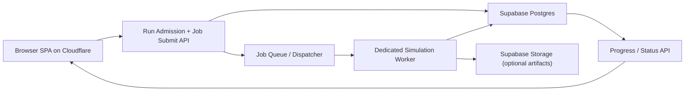
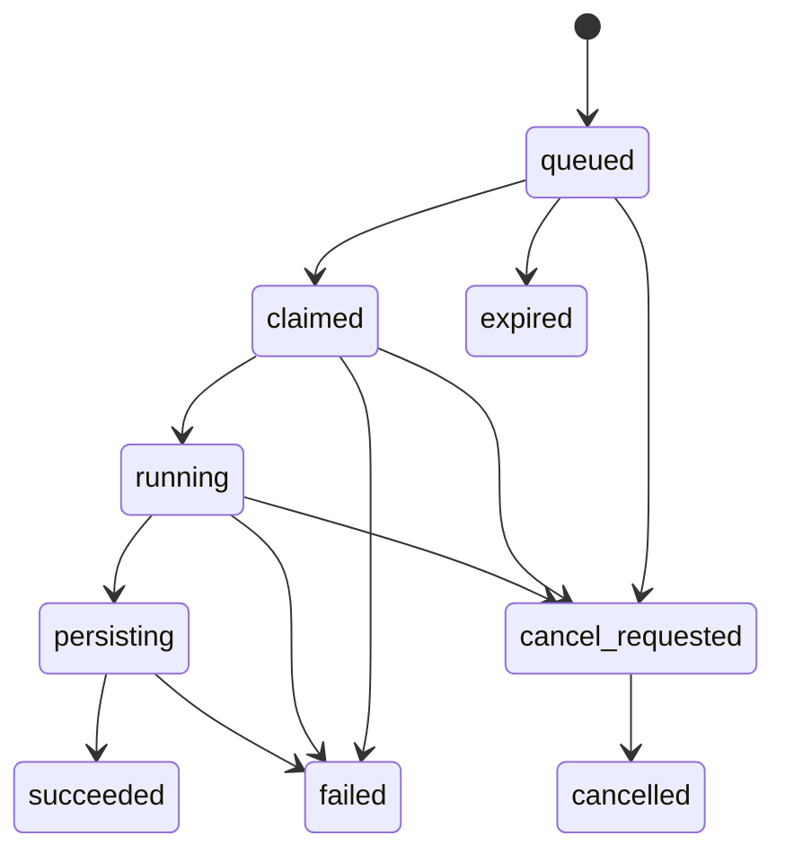

# DES Dedicated Worker Architecture

## Goal

Keep:

- Cloudflare for frontend hosting and lightweight web delivery
- Supabase for auth, model library, run metadata, and persisted results
- browser execution for small runs

Add:

- a dedicated simulation worker service for medium and large DES jobs

The key design principle is:

- interactive/small work stays client-side
- queued/heavier work moves to a durable async backend worker

## 1. Proposed Components



### Component list

#### Cloudflare-hosted frontend

Responsibilities:

- model editing
- small-run browser execution
- run admission checks
- submit medium/large jobs
- poll or subscribe for progress
- display run history and results

#### Submission API

This can be implemented as:

- a lightweight app backend
- or a small API route layer outside Supabase Edge Functions

Responsibilities:

- authenticate user
- authorize model access
- run admission policy
- create simulation job row
- enqueue work

Important:

- this API should not execute DES compute itself

#### Supabase Postgres

Responsibilities:

- source of truth for users, models, versions, runs, and jobs
- stores compact run metadata and summaries
- stores job state machine rows

#### Job queue / dispatcher

Responsibilities:

- decouple request/response web traffic from simulation execution
- hand jobs to workers
- support retries and backoff

Possible implementations:

- Postgres-backed queue using `simulation_jobs`
- managed queue such as Cloud Tasks, Pub/Sub, SQS, or Redis-backed worker queue

#### Dedicated simulation worker service

Responsibilities:

- fetch model JSON and run config
- execute `buildEngine(...).runAll()` or replication orchestration in Node
- emit progress snapshots
- write final compact results and optional artifacts

#### Supabase Storage

Responsibilities:

- optional large artifacts only:
  - debug trace
  - entity trace
  - full-resolution time series
  - debug log

## 2. Run Lifecycle

### Small run

1. Browser validates the model.
2. Browser classifies the run as `small`.
3. Browser executes locally.
4. Browser persists compact results to Supabase.

### Medium / large run

1. Browser validates the model.
2. Browser estimates complexity and classifies the run as `medium` or `large`.
3. Browser calls submit API with:
   - `model_id`
   - version or snapshot reference
   - run config
   - requested result detail level
4. API verifies user/session and model access.
5. API creates a `simulation_jobs` row in Postgres.
6. API enqueues the job.
7. Worker claims the job and marks it `running`.
8. Worker fetches model JSON and run configuration.
9. Worker executes the simulation.
10. Worker writes progress snapshots periodically.
11. Worker writes final results and optional artifacts.
12. Worker marks job `succeeded`, `failed`, or `cancelled`.
13. Browser reads progress and final results from Supabase-backed APIs.

## 3. Job Table / State Machine

### Recommended table

Suggested table: `simulation_jobs`

Suggested columns:

- `id uuid primary key`
- `model_id uuid not null`
- `version_id uuid null`
- `created_by uuid not null`
- `created_at timestamptz not null default now()`
- `started_at timestamptz null`
- `finished_at timestamptz null`
- `status text not null`
- `priority integer not null default 100`
- `run_config jsonb not null`
- `result_detail_level text not null`
- `submission_source text not null`
  - example: `browser`, `rerun`, `api`
- `lease_owner text null`
- `lease_expires_at timestamptz null`
- `attempt_count integer not null default 0`
- `max_attempts integer not null default 3`
- `last_heartbeat_at timestamptz null`
- `progress_json jsonb null`
- `error_json jsonb null`
- `cancel_requested boolean not null default false`
- `run_id uuid null references simulation_runs(id)`

### State machine

Suggested statuses:

- `queued`
- `claimed`
- `running`
- `persisting`
- `succeeded`
- `failed`
- `cancel_requested`
- `cancelled`
- `expired`

### State transitions



## 4. Authentication / Authorization

### Browser to submit API

Use the existing Supabase-authenticated user session.

Recommended pattern:

- browser sends Supabase access token
- submit API verifies token server-side
- API derives user identity from verified token, not from client-supplied user id

### Authorization rules

The submit API should verify:

- the user owns the model, or
- the model is accessible under the app’s existing sharing rules, and
- the user is allowed to create a run under plan/quota rules

### Worker credentials

The worker should use a server credential, not a browser user token.

Recommended:

- worker authenticates to Supabase with service role for server-side DB access
- user identity is still recorded in the job and run rows

Important boundary:

- worker must enforce authorization indirectly through a job row already created by the authenticated submission API
- worker should never accept arbitrary `model_id` execution requests directly from the internet

## 5. How The Worker Fetches Model JSON

### Preferred fetch source

Use the stored version or snapshot reference rather than trusting browser-submitted raw model JSON for medium/large runs.

Recommended precedence:

1. `version_id` if the run is pinned to a saved model version
2. `des_models.model_json` if running the current saved model
3. optional explicit immutable job snapshot for “run exactly this draft”

### Recommended strategy

For normal queued runs:

- submit API records either:
  - `version_id`, or
  - a canonical model snapshot in the job row

For reproducibility, queued runs should prefer immutable input:

- saved version snapshot if available
- otherwise a `model_snapshot` captured at job creation time

This avoids race conditions where the user edits the model after job submission.

## 6. How The Worker Writes Results

### Final write target

Worker writes a normal `simulation_runs` row so the rest of the product can continue using the same run-history surface.

### Write pattern

1. Worker builds compact results payload.
2. Worker inserts `simulation_runs` row with:
   - summary columns
   - provenance
   - compact `results_json`
3. Worker uploads optional debug artifacts to Supabase Storage if requested.
4. Worker updates `simulation_jobs.run_id`.
5. Worker marks job `succeeded`.

### Payload policy

Default worker saves should follow the compact results-storage strategy:

- compact summary in Postgres
- sampled queue time series
- resource utilisation summary
- runtime metrics
- warnings/errors
- optional artifact manifest

Do not persist raw debug artifacts by default for every queued run.

## 7. Progress Updates

### Progress model

DES progress is approximate, not exact, because future work can expand during execution.

Recommended progress JSON:

```json
{
  "phase": "running",
  "wall_clock_ms": 18420,
  "clock": 312.5,
  "replications_total": 20,
  "replications_completed": 7,
  "replication_index": 8,
  "events_processed": 48201,
  "c_event_scans": 193004,
  "entities_created": 11844,
  "max_queue_length_by_queue": {
    "Triage": 21
  },
  "message": "Running replication 8 of 20"
}
```

### Delivery options

Preferred order:

1. polling from browser
2. optional realtime subscription later

Polling is simpler and matches the existing app architecture better.

Recommended polling cadence:

- every `2` to `5` seconds while the results page is open

## 8. Cancellation

### User-facing behavior

User clicks Cancel in the UI.

### Backend behavior

1. Browser calls cancel API.
2. API verifies ownership/access.
3. API sets `cancel_requested = true` and status `cancel_requested`.
4. Worker checks cancellation flag between chunks:
   - between replications
   - between step batches for chunked single-run execution
5. Worker stops safely and marks job `cancelled`.

### Important design choice

Cancellation should be cooperative first, not hard-kill only.

Hard termination is still useful:

- if worker lease expires
- if worker crashes
- if a platform-level timeout occurs

## 9. Retries / Failures

### Retryable failures

Retry on:

- transient DB/network failures
- temporary queue or platform interruptions
- worker restart during execution before result persistence

Do not retry automatically on:

- deterministic model validation failures
- engine crashes caused by malformed or unsupported model data already proven invalid
- explicit cancellation

### Failure recording

Store compact error JSON such as:

```json
{
  "code": "WORKER_EXECUTION_ERROR",
  "message": "Phase C exceeded configured safety cap repeatedly",
  "retryable": false,
  "attempt": 2
}
```

### Lease / heartbeat model

Use lease-based claim semantics:

- worker claims job with `lease_owner` and `lease_expires_at`
- worker refreshes heartbeat periodically
- stale leased jobs can be safely reclaimed

## 10. Cost Controls

### Admission controls

Use the existing complexity-estimation and admission-rule direction before queueing jobs.

Examples:

- reject obviously too-large runs for the user’s tier
- cap replications by tier
- cap debug artifact detail on large runs

### Execution controls

- max wall-clock per job
- max replications per job
- max result detail level by tier
- max artifact bytes per run
- max queued jobs per user / workspace

### Persistence controls

- compact Postgres payloads by default
- sampled time series only by default
- optional debug traces only when explicitly requested
- retention expiry for large artifacts

## 11. Deployment Options

The worker should run on a platform suited to long-lived CPU-bound jobs and background processing.

### Good candidates

#### Google Cloud Run

Strengths:

- good for containerised stateless workers
- easy scale-to-zero and queue-driven scale-out
- good fit if paired with Cloud Tasks or Pub/Sub

Tradeoffs:

- request-style invocation model needs care for long jobs
- best when wrapped in queue/job orchestration rather than synchronous HTTP

#### Fly.io worker app

Strengths:

- simple long-running worker process model
- good fit for queue consumers
- straightforward container deploy

Tradeoffs:

- operational tuning is more hands-on than pure managed request platforms

#### Render background worker

Strengths:

- simple operational model
- easy dedicated background worker service

Tradeoffs:

- fewer low-level scaling controls than some cloud-native queue stacks

#### Similar worker-friendly platforms

Good fits share these properties:

- long-lived background processes
- durable queues
- support for CPU-bound jobs
- no assumption that work must finish inside an edge request budget

### Recommendation

Best architectural fit:

- lightweight submit API
- durable queue
- containerised Node worker

Cloud Run, Fly.io, and Render worker services are all plausible if they are used in that pattern.

## 12. What Remains In Supabase / Cloudflare

### Remains in Supabase

- authentication
- row-level access rules
- model library
- model versions
- run history
- compact result persistence
- optional artifact metadata
- optional artifact storage in Supabase Storage

### Remains in Cloudflare

- SPA hosting
- static asset delivery
- lightweight frontend-facing routing or APIs if desired

### Does not belong in Supabase Edge Functions or Cloudflare Workers

- medium/large DES execution
- replication-heavy CPU jobs
- long-running background simulation compute

## Recommended API Surface

Suggested endpoints:

- `POST /api/simulation-jobs`
  - submit medium/large run
- `GET /api/simulation-jobs/:id`
  - read status/progress
- `POST /api/simulation-jobs/:id/cancel`
  - request cancellation
- `GET /api/simulation-runs/:id`
  - existing run-history reader can remain Supabase-backed

## Recommended First Version

### MVP

- browser keeps small runs
- one queued job type for medium/large runs
- polling progress
- cooperative cancellation
- compact result writes only
- optional debug trace disabled initially

### Later enhancements

- realtime progress streams
- artifact download on demand
- per-replication child table
- autoscaling workers by queue depth
- tenant-aware cost and quota management

## Risks

- dual execution modes can drift if browser and worker runtime behavior diverge
- draft-model execution needs careful snapshot handling to stay reproducible
- progress reporting can add overhead if updates are too frequent
- cancellation must be chunk-aware to feel responsive
- service-role worker access must be tightly scoped operationally

## Recommended Next Steps

1. Define the `simulation_jobs` schema and state transition contract.
2. Decide whether queued runs always use immutable `model_snapshot` or prefer `version_id` when available.
3. Reuse the compact results-storage strategy for worker-written results from day one.
4. Add a queued-run admission rule that routes only medium/large jobs to the dedicated worker.
5. Document the runtime boundary clearly so future contributors do not confuse browser Web Workers with backend simulation workers.

## Tests Run

No tests were run for this task because the prompt requested an architecture design note rather than an implementation change.
