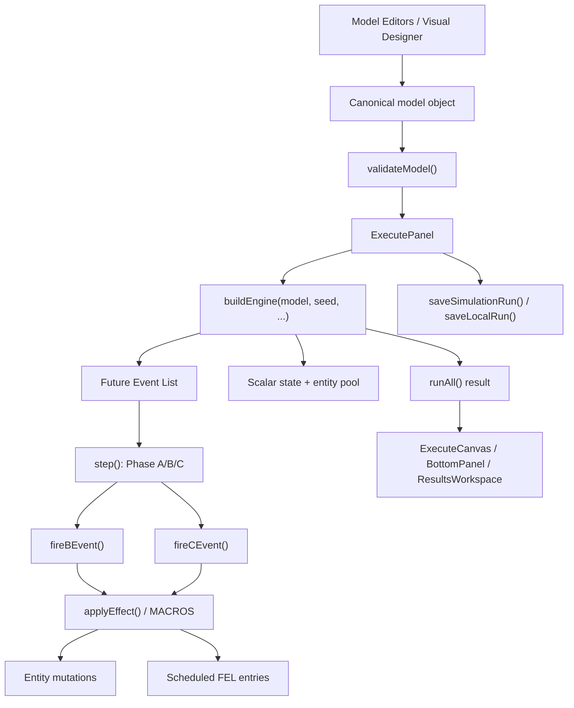

# Simulation Architecture Review

**Version:** 3.0 — all H-severity and M1 findings closed after Sprint 36
**Review date:** 2026-05-12
**Last updated:** 2026-05-15

Scope: simulation engine correctness, event scheduling, queue handling, entity lifecycle, deterministic reproducibility, UI/engine separation, rendering performance, persistence/data model design, extensibility, and simulation test coverage.

## Finding Status Summary

| ID | Severity | Finding | Status | Sprint Closed |
|----|----------|---------|--------|---------------|
| H1 | High | Phase C truncation not propagated from `runAll()` | ✅ Closed | Sprint 31–33 |
| H2 | High | Reneging timers bind to wrong entity globally | ✅ Closed | Pre-review (confirmed Sprint 36) |
| H3 | High | `COMPLETE()` allows waiting customers to become done | ✅ Closed | Pre-review (confirmed Sprint 36) |
| H4 | High | Service duration biased for `serviceStart = 0` | ✅ Closed | Sprint 36 |
| H5 | High | Initial B-events after t=900 silently excluded | ✅ Closed | Pre-review (confirmed Sprint 36) |
| H6 | High | Persisted model omits `graph` and `experimentDefaults` | ✅ Closed | Sprint 31–35 |
| M1 | Medium | Shift-capacity reduction leaves excess busy servers permanently | ✅ Closed | Pre-review (confirmed Sprint 36) |
| M2 | Medium | Warmup reset leaves stale customer-context FEL entries | ✅ Closed | Sprint 35 |
| M3 | Medium | V8 validation warns where contract says block | ✅ Closed (product decision) | Sprint 35 |
| M4 | Medium | Queue discipline logic duplicated between helpers and `ASSIGN()` | 🔴 Open | — |
| M5 | Medium | Legacy string conditions parallel JSON predicate language | 🔴 Open | — |
| M6 | Medium | Replication compaction drops `phaseCTruncated` field | ✅ Closed | Sprint 31–33 |
| L1 | Low | `runAll()` has dead local summary calculations | ✅ Closed | Sprint 35 |
| L2 | Low | Execute rendering repeatedly filters full entity arrays | 🔴 Open | — |
| L3 | Low | `Math.random()` outside simulation engine | ✅ Accepted | — |
| L4 | Low | Baseline Supabase schema not in committed migrations | 🔴 Open | — |

### Closure Notes

**H1** — `phaseCTruncated: _phaseCTruncated` returned at top level from `runAll()` in Sprints 31–33. UI now reads the top-level flag.

**M2** — Sprint 35 added `_requiresCtxEntity: true` to cSchedule FEL entries and narrowed warmup pruning to only `_isRenege` and `_requiresCtxEntity` entries. This correctly prunes stale COMPLETE/RENEGE events for removed entities without killing B-event self-schedules (next ARRIVE). Verified by 2 replication CI tests (30 M/M/1 + 20 M/M/c replications each with warmup=200, full `ci.n` achieved).

**M3** — Product decision: making individual missing-source or missing-sink a hard blocker would break ~20 UI tests and prevent valid one-way flows. Documented in code with product-decision comment. The V8 rule remains: both missing = hard error; individual missing = warning.

**M6** — `phaseCTruncated` preserved in `compactReplicationPayload()` in Sprint 31–33.

**L1** — Dead summary block removed from `runAll()` in Sprint 35. All summary construction now routes through `getSummary()`.

**L3** — Accepted: `Math.random()` in `src/db/local.js` and `src/db/models.js` is for local IDs and share tokens, not simulation reproducibility. No simulation test needed.

## Executive Summary

simmodlr has a recognizable and mostly well-separated discrete-event simulation architecture. The core engine lives under `src/engine/`, the execute UI calls the engine through `buildEngine()` and replication helpers, and persistence is concentrated in `src/db/models.js`. The current implementation preserves the central Three-Phase Method shape: Phase A clock advance, Phase B all-due event firing with tolerance, and Phase C priority restart after each C-event fire.

The highest risks are narrower than a system rewrite:

- Phase C truncation is logged inside the engine but not propagated through `runAll()` or the execute UI reliably.
- Some entity lifecycle transitions allow impossible states, especially `COMPLETE()` accepting waiting entities and service-duration calculations treating `serviceStart = 0` as missing.
- Reneging timers can bind to the newest waiting entity globally rather than the entity created by the event being scheduled.
- Shift-capacity reductions that encounter busy servers warn that excess busy servers will be retained until completion, but no later removal mechanism exists.
- Persistence is drifting from the documented canonical `model_json`: `graph` and `experimentDefaults` are handled in UI/export/import code but are not normalized or saved by `src/db/models.js`.

No code changes or refactors were made as part of this review. The only repository change is this review document.

## Architecture Overview

The current architecture is a browser-hosted DES modeller with three main layers:

| Layer | Main files | Observed responsibilities |
|---|---|---|
| Simulation engine | `src/engine/index.js`, `phases.js`, `macros.js`, `entities.js`, `conditions.js`, `distributions.js`, `validation.js` | Build runtime state, maintain FEL, fire B/C events, mutate entity/state objects, sample distributions, validate model structure. |
| Execution orchestration | `src/engine/replication-runner.js`, `src/engine/worker.js`, `src/ui/execute/index.jsx` | Run single simulations in-process, run replications through workers/inline fallback, collect results, save run history, display validation and run state. |
| UI and visualization | `src/ui/execute/ExecuteCanvas.jsx`, `BottomPanel.jsx`, `src/ui/visual-designer/graph.js`, editors under `src/ui/editors/` | Author model JSON, derive graph topology, render live execution state and result views. |
| Persistence | `src/db/models.js`, `src/db/local.js`, Supabase migrations | Save/fetch models, runs, share links, sweeps, settings, and local anonymous data. |

## System/Component Map

Key boundaries observed:

- `src/engine/` does not import React or DOM APIs in the reviewed files.
- `src/ui/execute/index.jsx` imports `buildEngine`, `mulberry32`, `runReplications`, statistics helpers, and `validateModel`. This is broader than the original architectural note that only `buildEngine()` should cross the UI boundary, but the imports remain execute-only and not editor-wide.
- Supabase calls in reviewed UI execution paths go through `src/db/models.js`; no direct Supabase query was found in `src/ui/execute/index.jsx`.

## Findings Grouped by Severity

### Critical

No Critical findings were identified from the inspected implementation. The core loop does not currently show evidence of duplicate Phase B execution at the same clock tick, unsafe dynamic code execution, or engine/UI circular imports.

### High

| ID | Finding | Evidence | Why It Matters | Recommended Fix | Regression Tests |
|---|---|---|---|---|---|
| H1 | Phase C truncation is not propagated from `runAll()` to results or UI. | `src/engine/index.js:370-376` tracks `anyPhaseCTruncated`, but `src/engine/index.js:397-407` returns no top-level or summary flag. `src/ui/execute/index.jsx:386` checks `result.summary?.phaseCTruncated`, and `src/ui/execute/index.jsx:1479` only renders the warning when `phaseCTruncated && model.maxCPasses`. | A model with unstable C-scan can silently appear successful after `Run All`. This violates the engine correctness contract that truncation must be visible. | Return `phaseCTruncated: anyPhaseCTruncated` at top level and include it in `summary.warnings` or `summary.phaseCTruncated`. Render the banner based on the actual cap used, not `model.maxCPasses`. | Add an engine test where a C-event remains perpetually true and assert `runAll().phaseCTruncated === true`. Add an execute UI test that `Run All` shows the Phase C cap warning with default max passes. |
| H2 | Reneging timers can attach to the newest waiting entity globally, not the entity produced by the current event. | `src/engine/phases.js:238-251` handles `sched.isRenege` by sorting all waiting entities and selecting the newest. It ignores `effectCtx._lastCustId`, which already tracks the current event context. | If several queues or entity types have waiting entities at the same simulation time, an abandonment timer can cancel the wrong customer. This corrupts entity lifecycle and abandonment statistics. | Bind reneging schedules to `effectCtx._lastCustId` when available. If no current customer exists, fail visibly or log a warning rather than choosing globally. | Add a two-queue same-tick model where an older event schedules a reneging timer while another entity has a later `arrivalTime`; assert only the intended entity reneges. |
| H3 | `COMPLETE()` allows a waiting customer to become done. | `src/engine/macros.js:279` accepts `cust.status === "serving" || cust.status === "waiting"`. It then records a stage and increments `state.__served` at `src/engine/macros.js:280-293`. | A completion B-event with stale or wrong context can remove a customer that was never seized. This creates impossible states and can mask cancellation bugs. | Restrict `COMPLETE()` to `serving` entities unless there is a deliberately modelled direct-exit macro/path. For stale contexts, log a skipped completion and do not increment served. | Add tests for a scheduled `COMPLETE()` against a waiting entity and assert it is skipped. Add stale-context tests after `RENEGE(ctx)` fires before `COMPLETE()`. |
| H4 | Service duration and average service time are biased for `serviceStart = 0` and mixed completion paths. | `src/engine/macros.js:287` and `src/engine/macros.js:328` compute `clock - (cust.serviceStart || clock)`, so service starting at time 0 records zero duration. `src/engine/index.js:455-458` divides filtered service-time sums by `served.length`, not by the filtered count. | Service-time KPIs are core simulation outputs. Current math undercounts service that starts at zero and can dilute averages when some done entities have no service context. | Use nullish checks: `cust.serviceStart ?? clock`. Divide by the count of entities included in the service-time numerator. Consider deriving average service from `stages[].stageService` for multi-stage systems. | Add a deterministic model with service from t=0 to t=5 and assert `stageService` and `avgSvc` are 5. Add a mixed direct-exit plus served-customer test. |
| H5 | Initial B-events after t=900 are silently excluded. | `src/engine/index.js:18` defines `INITIAL_FEL_MAX_SCHEDULED_TIME = 900`. `src/engine/index.js:198-199` filters initial B-events by this hard cap before mapping scheduled times. | A valid model with a first scheduled event at t=1000 or a long-horizon source is silently altered. This is an event ordering/scheduling correctness issue because the FEL is not the model's full initial event set. | Remove the arbitrary cap or make it an explicit validation/configuration limit tied to `maxSimTime`. If filtering remains, surface a blocking validation error or run warning. | Add a model with one B-event at t=1000 and `maxSimTime=1200`; assert it fires. Add validation coverage for any intentionally skipped events. |
| H6 | Persisted model shape omits `graph` and `experimentDefaults` despite UI/export support. | `src/ui/ModelDetail.jsx:21-53` treats `graph` and `experimentDefaults` as canonical export keys. `src/App.jsx:22` and `src/App.jsx:91-106` import them. `src/db/models.js:40-55` normalizes only denormalized columns and `src/db/models.js:62-75` saves no `graph`, `experimentDefaults`, or `model_json`. | Visual layout metadata and experiment defaults can be lost across save/load in Supabase-backed mode. This undermines the one-canonical-model contract and can make run reproducibility settings disappear. | Decide on one persistence contract: either store a full `model_json` JSONB with all canonical keys and denormalize selected columns, or add explicit columns and include them in `norm()`, `toRow()`, and selects. | Add DB wrapper tests that save/fetch a model with `graph` and `experimentDefaults` and assert round trip preservation. Add import/save/reload tests for graph layout and default run settings. |

### Medium

| ID | Finding | Evidence | Why It Matters | Recommended Fix | Regression Tests |
|---|---|---|---|---|---|
| M1 | Shift-capacity reduction can permanently exceed the target when excess servers are busy. | `src/engine/phases.js:35-48` removes only idle excess servers and warns retained busy servers remain until completion. `COMPLETE()` only sets the server idle at `src/engine/macros.js:296-298`; no later target-capacity reconciliation exists. | A time-varying capacity schedule can overstate available capacity after busy servers finish. This distorts wait times and throughput. | Track desired capacity per server type in state. After each completion or release, retire idle excess servers until actual count equals desired count. | Add a shift schedule from 2 to 1 while both servers are busy; after one completion, assert one server is retired and capacity is 1. |
| M2 | Warm-up reset removes completed/reneged customers but does not clear queued or scheduled pre-warm-up customer context. | `src/engine/index.js:275-288` resets counters and filters done/reneged entities only. FEL entries carrying `_contextCustId` remain untouched. | A completion or reneging event scheduled before warm-up can fire after warm-up for an entity whose statistics should not count, or for a removed entity. Evidence is insufficient to prove a failing case without a specific model, but the retained FEL context is visible in code. | Define warm-up semantics explicitly: either keep active entities and mark their pre-warm-up stage history excluded, or purge/rebase all customer-context FEL entries. | Add warm-up tests with a customer starting service before warm-up and completing after warm-up; assert served, wait, service, and sojourn handling match the chosen policy. |
| M3 | Validation does not block no-arrival/no-sink models even though the documented rule says V8 is blocking. | `src/engine/validation.js:275-292` emits `warn('V8', ...)` for missing ARRIVE and missing COMPLETE/RENEGE. | The execute panel may run structurally empty or non-terminating models as warnings. This is a product decision mismatch with the documented pre-run validation table and increases risk of misleading runs. | Reclassify V8 as blocking if the contract remains unchanged, or update the contract and UI copy to make this intentionally permissive. | Update validation tests to assert V8 errors for missing source/sink, or explicitly assert warnings after documentation is changed. |
| M4 | Queue discipline logic is duplicated between helpers and `ASSIGN()`. | `src/engine/entities.js:95-112` sorts `waitingOf()` by discipline. `src/engine/macros.js:221-236` repeats queue-name discipline sorting inline. | Duplicated selection logic makes future disciplines or fairness policies easy to implement inconsistently. | Add a helper that selects waiting entities by queue name and discipline, then use it from `ASSIGN()`, `BATCH()`, and `RENEGE_OLDEST()`. | Add one integration test per discipline through `ASSIGN(QueueName, ServerType)`, not only `waitingOf()`. |
| M5 | Legacy string conditions remain a parallel condition language. | `src/engine/conditions.js:145-205` implements `evalCondition(condition, ...)` over strings, while `evaluatePredicate()` handles JSON predicates at `src/engine/conditions.js:114-123`. | Two condition languages increase maintenance and validation surface. The string evaluator has flat left-to-right `AND`/`OR` semantics in `safeEvalExpr()` at `src/engine/conditions.js:40-63`, while JSON predicates support explicit nesting. | Migrate C-event and termination conditions to JSON predicates at the engine boundary, keeping string support only as an import/backward-compat adapter. | Add migration tests converting common string conditions to JSON predicates and asserting identical results. Add mixed `AND`/`OR` precedence tests documenting current and target behavior. |
| M6 | Replication UI checks a field that compacted worker results do not provide. | `src/engine/replication-runner.js:45-59` compacts results but only preserves `result.summary`; `src/ui/execute/index.jsx:300` checks `payload.result?.summary?.phaseCTruncated`. | Even if the engine starts returning a top-level truncation flag, the replication path will still drop it unless the compact payload includes it. | Preserve top-level `phaseCTruncated` and/or summary warnings in `compactReplicationPayload()`. | Add `runReplications()` test with a synthetic completed payload containing truncation metadata and assert it survives compaction. |

### Low

| ID | Finding | Evidence | Why It Matters | Recommended Fix | Regression Tests |
|---|---|---|---|---|---|
| L1 | `runAll()` has dead local summary calculations. | `src/engine/index.js:384-396` computes `customers`, `served`, `avgWait`, `avgSvc`, etc., but returns `summary: getSummary()` at `src/engine/index.js:403`. | Dead calculations add cognitive load and can diverge from real output logic. | Remove the unused block or route all summary construction through a single pure summary function. | Static or unit test not required; covered by existing summary tests. |
| L2 | Execute rendering repeatedly filters full entity arrays. | `src/ui/execute/ExecuteCanvas.jsx:472-543` derives node data by filtering entities for each render; `src/ui/execute/BottomPanel.jsx:90-177` performs similar repeated filters. | This is acceptable for small models but can become expensive when entity pools reach thousands and snapshots/logs are frequent. | Build indexed snapshot summaries in the engine or a memoized selector: by queue, by type, by status, by server type. | Add a render-performance smoke test or benchmark with 10k entities to detect slow regressions. |
| L3 | Local ID/share-token fallback uses `Math.random()` outside the simulation engine. | `src/db/local.js:18` and `src/db/models.js:377` use `Math.random()` for local IDs/fallback share tokens. | This does not affect simulation reproducibility, but it can confuse broad searches for prohibited `Math.random()` in simulation code. | Leave as acceptable non-simulation code, or wrap non-simulation randomness in a named utility to make intent clear. | No simulation test needed. Add a lint/search guard scoped to `src/engine/` if tooling is introduced. |
| L4 | Base Supabase schema evidence is incomplete in the committed migrations. | The reviewed migrations add/alter tables but do not include a committed `create table public.des_models` or `create table public.simulation_runs` baseline. `src/db/models.js:214` also comments that cascade behavior is not confirmed. | Review confidence for persistence constraints and cascade semantics is limited. | Add a baseline schema migration or checked-in schema dump for the current production database. | Add migration/schema tests or a generated schema snapshot in CI. |

## Evidence With Exact File References

Key code paths inspected:

- `src/engine/index.js:84` defines `buildEngine()`.
- `src/engine/index.js:228-355` implements one Phase A/B/C `step()`.
- `src/engine/index.js:269-270` fires all due B-events at the current clock using `< 1e-9` tolerance.
- `src/engine/index.js:305-333` sorts C-events by explicit priority and breaks after each C-event fire.
- `src/engine/phases.js:114-259` implements B-event firing and event scheduling.
- `src/engine/phases.js:261-298` implements C-event firing and structured `cSchedules`.
- `src/engine/macros.js:85-495` defines the macro registry and mutates entity lifecycle state.
- `src/engine/entities.js:93-112` implements FIFO/LIFO/PRIORITY waiting selection.
- `src/engine/distributions.js:9-20` defines seeded `mulberry32`; `src/engine/distributions.js:145-153` requires an RNG for sampling.
- `src/engine/validation.js:14-514` implements pre-run model validation.
- `src/engine/replication-runner.js:66-179` manages worker pool scheduling, completion, cancellation, and failure.
- `src/ui/execute/index.jsx:123-137` runs validation in the execute panel.
- `src/ui/execute/index.jsx:143-154` initializes a single-step engine.
- `src/ui/execute/index.jsx:246-407` runs single and batch simulations.
- `src/db/models.js:40-75` maps models to/from Supabase rows.

## Root Cause Analysis

Several issues share common causes:

- **Context propagation is implicit.** B/C event execution uses `_contextCustId`, `_contextSrvId`, and mutable `lastCustId`/`lastSrvId` fields. This works for the common path, but edge cases such as reneging, stale completion, warm-up, and route changes need stronger context contracts.
- **Lifecycle transitions are not centralized.** Entity status changes are spread across macros and phase routing helpers. This makes it easy for one path to set `done`, another to set `waiting`, and a third to increment served without a shared invariant check.
- **Result metadata is split across logs, summary, and UI flags.** Phase C truncation is detected in `step()` but not represented as durable result metadata.
- **Persistence evolved by denormalized columns while UI evolved around canonical `model_json`.** Import/export and ModelDetail know about `graph` and `experimentDefaults`, but `models.js` still saves only denormalized arrays.
- **Tests are strong at helper/unit level but thinner at edge-case integration level.** Existing tests cover seeded RNG, Three-Phase restart, queue helper discipline, replication ordering/cancellation, and many UI flows. The gaps are mostly cross-feature lifecycle cases.

## Recommended Fixes

1. Introduce a small lifecycle transition layer in `src/engine/`:
   - `startService(customer, server, clock, queueName)`
   - `completeService(customer, server, clock)`
   - `releaseToQueue(customer, server, queueName, clock)`
   - `renegeWaiting(customer, clock)`
   - Each function should assert valid from/to states and return structured warnings/errors.

2. Make run metadata explicit:
   - Return `phaseCTruncated`, `cycleLimitHit`, `warnings`, and `terminationReason` from `runAll()`.
   - Store these in `results_json` and preserve them through replication compaction.

3. Replace the arbitrary initial FEL cap:
   - Seed the initial FEL from all finite scheduled B-events.
   - Let `maxSimTime` decide runtime truncation.
   - Validate non-finite scheduled times before execution.

4. Unify queue/entity selection:
   - Move queue-name selection into `entities.js`.
   - Reuse it for `ASSIGN`, `BATCH`, `RENEGE_OLDEST`, and future selection constructs.

5. Align persistence with canonical model JSON:
   - Either save full `model_json` as canonical and derive columns, or explicitly persist every canonical key.
   - Include `graph` and `experimentDefaults` in `norm()`, `toRow()`, selects, tests, and migrations.

6. Clarify warm-up policy:
   - Decide whether in-service entities at warm-up continue with post-warm-up completion counted, excluded, or partially attributed.
   - Encode that policy in entity stage data rather than deleting only done/reneged entities.

## Refactoring Opportunities

- Extract a pure `createInitialFel(model, options)` function from `buildEngine()` and unit test event ordering, invalid times, time-varying rates, shifts, and warm-up insertion.
- Extract `buildSummary(entities, state, options)` from the closure in `buildEngine()` so summary math is directly testable.
- Replace macro effect strings with structured actions at the engine boundary. The macro registry is extensible, but regex parsing still makes validation and context contracts harder.
- Introduce a model schema module shared by import/export, DB normalization, validation, and editor defaults.
- Add a snapshot index builder for UI rendering: `indexSnapshot(snap)` returning entities by queue/type/status and server summaries.

## Test Coverage Gaps

Existing coverage observed:

- Three-Phase restart behavior: `tests/engine/three-phase.test.js`.
- Queue helper FIFO/LIFO/PRIORITY behavior: `tests/engine/entities.test.js`.
- Seeded distribution reproducibility: `tests/engine/distributions.test.js`.
- Replication worker ordering/cancellation/failure: `tests/engine/replication-runner.test.js`.
- Validation warnings around selected known defects: `tests/engine/validation.test.js`.
- Execute panel UI workflows: `tests/ui/execute/execute-panel.test.jsx`.

Major gaps to add:

- Phase C truncation propagation through `runAll()`, replication compaction, saved run history, and execute UI banner.
- Reneging context with multiple waiting entities and same-clock arrivals.
- Completion cancellation/stale-context behavior when an entity reneges before its completion event.
- Service that starts at t=0 and multi-stage service totals.
- Shift-capacity reduction with busy excess servers that finish after the shift change.
- Initial B-events scheduled beyond t=900.
- Supabase model round trip for `graph`, `experimentDefaults`, and any future canonical keys.
- Warm-up semantics for in-service and queued entities.
- Integration tests for queue discipline through `ASSIGN(QueueName, ServerType)`, not only `waitingOf()`.

## Prioritized Action Plan

| Priority | Action | Severity addressed |
|---|---|---|
| P0 | Propagate `phaseCTruncated` from `step()` to `runAll()`, replication payloads, saved results, and UI warnings. | H1, M6 |
| P0 | Fix lifecycle invariants around `COMPLETE()`, stale contexts, reneging target binding, and `serviceStart = 0`. | H2, H3, H4 |
| P1 | Remove or validate the initial FEL t=900 cap. | H5 |
| P1 | Align persistence around full canonical model JSON, including `graph` and `experimentDefaults`. | H6 |
| P1 | Implement desired-capacity reconciliation for shift schedules. | M1 |
| P2 | Centralize queue selection and lifecycle transition helpers. | M4 |
| P2 | Resolve the V8 warning/error contract mismatch. | M3 |
| P2 | Define and test warm-up handling for active entities and context-carrying FEL entries. | M2 |
| P3 | Add rendering selectors/indexes for large snapshots. | L2 |
| P3 | Commit baseline DB schema evidence or schema snapshot. | L4 |

## Final Architectural Assessment

simmodlr's simulation architecture is viable and already has several strong properties: deterministic seeded sampling in engine code, a visible Three-Phase loop, sorted FEL insertion after generated events, queue-discipline support, worker-based replications, and a mostly clean separation between engine and UI.

The architecture now needs invariant hardening rather than broad replacement. The best next step is to make the engine's implicit lifecycle and context rules explicit, then carry correctness metadata all the way to UI and persistence. After that, persistence should be reconciled with the canonical `model_json` contract so future simulation constructs can be added without losing model state between authoring modes.
